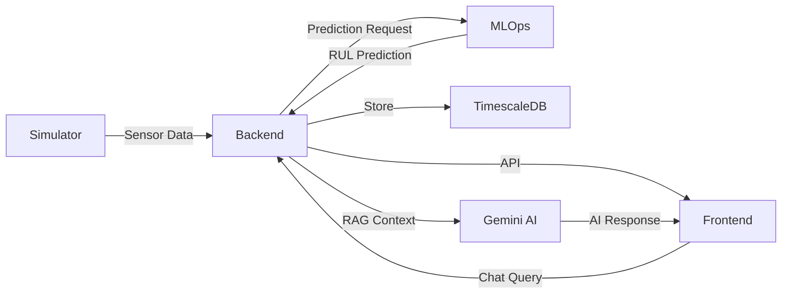

# Railway Deployment Guide - NT-POC Battery Management System

This guide provides step-by-step instructions for deploying the NT-POC Battery Management System to Railway with automatic database migrations, RAG-enabled chatbot, and full service integration.

## Production-Ready Features

✅ **Automatic Database Migrations** - Runs on every deployment
✅ **RAG-Enabled AI Chatbot** - Context-aware assistant with real-time data
✅ **MLOps Integration** - RUL predictions with circuit breaker pattern
✅ **Sensor Data Ingestion** - Real-time battery monitoring
✅ **Health Checks** - All services have readiness probes
✅ **Error Handling** - Comprehensive retry logic and logging
✅ **Production Optimized** - Multi-stage Docker builds

## Quick Start

### 1. Deploy Database
- Create PostgreSQL service on Railway
- Enable TimescaleDB extension

### 2. Deploy Backend (with automatic migrations)
```bash
# Railway will automatically:
# - Build Docker image
# - Wait for database
# - Run migrations
# - Start server
```

### 3. Deploy Support Services
- MLOps service (ML predictions)
- Simulator service (sensor data)

### 4. Deploy Frontend
- Configure API endpoints
- Add Gemini API key for chatbot

## Service Architecture

```
Frontend (React) ─── Backend (Express)  ─── PostgreSQL + TimescaleDB
                              │
                              ├─── MLOps (FastAPI)
                              └─── Simulator (FastAPI)
```

## Automatic Migrations

The backend service automatically runs migrations on deployment using:

**scripts/start-production.sh**:
- Waits for database connection (30 retries)
- Runs `npm run migrate`
- Checks migration status
- Starts the server

**Configuration** (`railway.json`):
```json
{
  "build": { "builder": "DOCKERFILE" },
  "deploy": {
    "startCommand": "bash scripts/start-production.sh",
    "healthcheckPath": "/api/v1/health"
  }
}
```

## Environment Variables

### Backend (Required)

```bash
# Database - use Railway references
DB_HOST=${{Postgres.PGHOST}}
DB_PORT=${{Postgres.PGPORT}}
DB_NAME=${{Postgres.PGDATABASE}}
DB_USER=${{Postgres.PGUSER}}
DB_PASSWORD=${{Postgres.PGPASSWORD}}
DB_SSL=true

# JWT
JWT_SECRET=<generate-256-bit-secret>
JWT_EXPIRY=24h

# Service URLs - use Railway private domains
MLOPS_SERVICE_URL=https://${{MLOps.RAILWAY_PRIVATE_DOMAIN}}
SIMULATOR_URL=https://${{Simulator.RAILWAY_PRIVATE_DOMAIN}}

# Sensor Ingestion
SENSOR_INGESTION_ENABLED=true
SENSOR_INGESTION_INTERVAL=10000
```

### Frontend (Required)

```bash
# API - use Railway public domain
VITE_API_BASE_URL=https://${{Backend.RAILWAY_PUBLIC_DOMAIN}}

# Gemini API for RAG Chatbot
VITE_GEMINI_API_KEY=<your-google-gemini-key>
```

## Testing Deployment

### 1. Check Backend Health
```bash
curl https://your-backend.railway.app/api/v1/health
```

Expected response:
```json
{
  "status": "ok",
  "database": "connected",
  "migrations": "up-to-date"
}
```

### 2. Test Data Flow

1. **Simulator** generates sensor data
2. **Backend** ingests data (check logs for `sensor_ingestion_run_completed`)
3. **MLOps** predicts RUL (check logs for `scheduled_prediction_job_run_completed`)
4. **Frontend** displays real-time data
5. **Chatbot** answers queries with RAG context

### 3. Test RAG Chatbot

Open frontend → Click chat widget → Try:
- "What's the current status?" (system summary)
- "Show me critical alerts" (queries database)
- "What's the battery health?" (SoH data)
- "Search for battery-1" (search functionality)

## Troubleshooting

### Migrations Don't Run

**Check startup logs**:
```
🚀 Starting NT-POC Backend Service...
⏳ Waiting for database connection...
✅ Database connection established
🔄 Running database migrations...
✅ Database migrations completed successfully
🚀 Starting application server...
```

If migrations fail:
```bash
# Manual migration from Railway shell
npm run migrate
npm run migrate:status
```

### Service Communication Issues

**Backend can't reach MLOps/Simulator**:
- Verify environment variables use Railway domain references
- Check services are deployed and healthy
- Test from backend shell: `curl $MLOPS_SERVICE_URL/health`

**Frontend can't reach Backend**:
- Verify `VITE_API_BASE_URL` is correct
- Check CORS configuration
- Ensure backend service is public

### RAG Chatbot Issues

- Verify `VITE_GEMINI_API_KEY` is set
- Check `/api/v1/chatbot/*` endpoints are accessible
- Review browser console and backend logs

### MLOps Circuit Breaker

If you see `mlops_circuit_breaker_opened`:
- MLOps service is down or unresponsive
- Circuit breaker will auto-recover after 60 seconds
- Check MLOps service health and logs

## Data Flow Verification



## Railway Configuration Files

All services have proper Railway configurations:

- `services/backend/railway.json` - With auto-migrations
- `services/frontend/railway.json` - With health checks
- `services/mlops/railway.json` - With health checks
- `services/simulator/railway.json` - With health checks

## Production Checklist

- [ ] PostgreSQL + TimescaleDB extension installed
- [ ] Backend environment variables configured
- [ ] Frontend environment variables configured
- [ ] Gemini API key added for chatbot
- [ ] Service-to-service URLs configured (Railway references)
- [ ] All services deployed and healthy
- [ ] Database migrations completed
- [ ] Health checks passing
- [ ] Sensor data flowing (check logs)
- [ ] RUL predictions running (every 60 minutes)
- [ ] Chatbot RAG working
- [ ] Frontend loading and responsive

## Support

For issues or questions:
- Check Railway service logs
- Review `/api/v1/health` endpoints
- Enable debug logging: `LOG_LEVEL=debug`
- Check GitHub repository issues

---

**Version**: 1.0.0  
**Last Updated**: 2026-01-16
