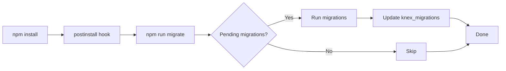

# T230: Database Migrations - Quick Reference

## 🚀 Quick Commands

```bash
# Run all pending migrations
npm run migrate

# Check what's applied and pending
npm run migrate:status

# Rollback last batch
npm run migrate:rollback

# Setup database (migrate + seed)
npm run db:setup

# Run seed data
npm run seed:run

# Create new migration
npm run migrate:make <name>
```

## 📁 Project Structure

```
services/backend/
├── knexfile.ts                 # Knex configuration
├── src/config/knex.ts          # Knex instance
├── migrations/                 # Migration files
│   ├── 20240101000000_create_core_tables.ts
│   ├── 20240102000000_create_rul_predictions.ts
│   └── 20240103000000_create_model_performance_tables.ts
├── seeds/                      # Seed files
│   └── 001_initial_data.ts
├── scripts/                    # Utility scripts
│   ├── migrate.ts
│   ├── migrate-status.ts
│   └── migrate-rollback.ts
└── MIGRATIONS.md               # Full documentation
```

## 🗄️ Database Tables

| Table | Description | Records |
|-------|-------------|---------|
| `facilities` | Facility locations | 3 seed records |
| `battery_systems` | Battery inventory | 5 seed records |
| `sensor_readings` | Time-series data | 120 seed records |
| `alerts` | System alerts | 2 seed records |
| `rul_predictions` | RUL predictions | 5 seed records |
| `model_predictions` | Model tracking | - |
| `model_performance_metrics` | Accuracy metrics | - |
| `model_drift_metrics` | Drift detection | - |
| `data_quality_metrics` | Data quality | - |
| `model_health_alerts` | Health alerts | - |
| `model_health_scores` | Health scores | - |
| `knex_migrations` | Migration tracking | Auto-managed |

## 🔧 Environment Variables

```env
DB_HOST=localhost
DB_PORT=5432
DB_NAME=battery_management
DB_USER=postgres
DB_PASSWORD=postgres
DB_SSL=false                    # true for production
NODE_ENV=development           # development | test | production
```

## 📝 Create New Migration

```bash
# Create migration file
npm run migrate:make add_new_column

# Edit the generated file
# migrations/20240105123456_add_new_column.ts
```

**Template:**
```typescript
import type { Knex } from 'knex';

export async function up(knex: Knex): Promise<void> {
  await knex.schema.table('table_name', (table) => {
    table.string('new_column');
  });
}

export async function down(knex: Knex): Promise<void> {
  await knex.schema.table('table_name', (table) => {
    table.dropColumn('new_column');
  });
}
```

## 🚀 Deployment

### Automatic (Recommended)
```bash
npm install  # Runs migrations automatically via postinstall hook
npm start
```

### Manual
```bash
npm run migrate
npm start
```

## 🔄 Migration Workflow



## 🛠️ Common Column Types

```typescript
// UUID
table.uuid('id').primary().defaultTo(knex.raw('gen_random_uuid()'))

// Strings
table.string('name', 255).notNullable()
table.text('description')

// Numbers
table.integer('count')
table.decimal('price', 10, 2)

// Booleans
table.boolean('is_active').defaultTo(false)

// Timestamps
table.timestamp('created_at', { useTz: true }).defaultTo(knex.fn.now())

// JSON
table.jsonb('metadata').defaultTo('{}')

// Enums
table.enum('status', ['active', 'inactive'])

// Foreign Keys
table.uuid('user_id')
  .references('id')
  .inTable('users')
  .onDelete('CASCADE')

// Indexes
table.index('column_name')
table.index(['col1', 'col2'])
table.unique('email')
```

## ✅ Checklist for New Migrations

- [ ] Created with `npm run migrate:make <name>`
- [ ] Has both `up()` and `down()` functions
- [ ] Includes proper indexes
- [ ] Foreign keys have CASCADE behavior
- [ ] Tested `up()` migration
- [ ] Tested `down()` rollback
- [ ] Follows naming conventions
- [ ] Uses transactions for data changes

## 🐛 Troubleshooting

### Connection Error
```bash
# Check PostgreSQL is running
psql -h localhost -U postgres -d battery_management

# Check environment variables
echo $DB_HOST $DB_NAME $DB_USER
```

### Migration Failed
```bash
# Check status
npm run migrate:status

# View detailed error
npm run migrate 2>&1 | tee migration.log

# Rollback if needed
npm run migrate:rollback
```

### Reset Database (Dev Only)
```bash
# ⚠️ DELETES ALL DATA
npm run migrate:rollback  # Repeat for each batch
npm run migrate
npm run seed:run
```

## 📚 Documentation

- **Full Guide**: `MIGRATIONS.md`
- **Knex Docs**: https://knexjs.org/
- **Schema Builder**: https://knexjs.org/guide/schema-builder.html
- **Migrations API**: https://knexjs.org/guide/migrations.html

## 🎯 Key Features

✅ **Automatic execution** on deployment  
✅ **Full rollback support**  
✅ **Status monitoring**  
✅ **TypeScript support**  
✅ **Environment-specific configs**  
✅ **Transaction safety**  
✅ **Well-documented**  

## 📊 Migration Status Example

```
📊 Checking migration status...

✅ Completed migrations (3):
   ✓ 20240101000000_create_core_tables.ts
   ✓ 20240102000000_create_rul_predictions.ts
   ✓ 20240103000000_create_model_performance_tables.ts

✨ All migrations are up to date!
```

## 🔐 Production Checklist

- [ ] DB_SSL=true in environment
- [ ] Database credentials secured
- [ ] Backup before deployment
- [ ] Test migrations in staging
- [ ] Monitor migration logs
- [ ] Verify application starts after migration
