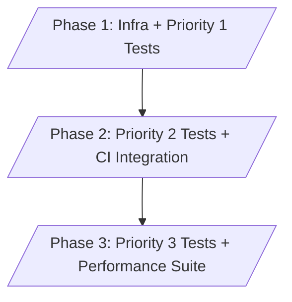

# NT-POC Battery Management System - Integration Test Strategy

_Last updated: 2026-01-13_

Source inputs: [INTEGRATION_TEST_ARCHITECTURE_ANALYSIS.md](INTEGRATION_TEST_ARCHITECTURE_ANALYSIS.md:1), [TEST_INFRASTRUCTURE_GUIDE.md](development/TEST_INFRASTRUCTURE_GUIDE.md:1), [docker-compose.yml](../docker-compose.yml:1).

## 1. Executive Summary
- Establish a unified integration test program covering all six services, three authentication methods, 47+ API endpoints, and eight critical integration points identified in [INTEGRATION_TEST_ARCHITECTURE_ANALYSIS.md](INTEGRATION_TEST_ARCHITECTURE_ANALYSIS.md:1).
- Close current gaps (inter-service, scheduled jobs, SSE, external APIs) by layering API-level, service-to-service, workflow, and non-functional tests into the existing Vitest/pytest/Playwright toolchain documented in [TEST_INFRASTRUCTURE_GUIDE.md](development/TEST_INFRASTRUCTURE_GUIDE.md:1).
- Deliver phased coverage that protects critical production paths first, integrates into CI/CD, and scales toward performance and chaos validation.

## 2. Testing Scope & Objectives
### 2.1 In Scope
- Backend REST APIs (35 routes) including facilities, alerts, sensor readings, ML proxies, jobs, SSE, and monitoring endpoints.
- Service-to-service flows: Backend ⇄ MLOps, Backend ⇄ Simulator, Backend ⇄ LINE Bot, Backend ⇄ external APIs (SendGrid, Mapbox, OpenWeather).
- Authentication layers: JWT bearer, API key, LINE signature verification.
- PostgreSQL/TimescaleDB interactions: schema migrations, constraints, hypertable writes/reads, transaction semantics.
- Real-time mechanisms (SSE stream) and scheduled jobs (prediction, escalation, ingestion).
- Python services (MLOps, Simulator, ML training orchestration) exposed via FastAPI or batch scripts.

### 2.2 Out of Scope
- Pure unit/component tests already in service repositories.
- Manual exploratory testing or hardware lab validation beyond Simulator API coverage.
- Production monitoring/alerting verification (covered separately in [MONITORING_ALERTING.md](../MONITORING_ALERTING.md:1)).

### 2.3 Success Criteria
- Demonstrate automated verification for every critical integration point with deterministic pass/fail results.
- Provide executable documentation (this strategy + test READMEs) enabling onboarding within one iteration.
- Integrate with CI gates so that regressions in inter-service paths block merges.

## 3. Test Categories & Approach
### 3.1 API Endpoint Integration Tests
- Tooling: Vitest + Supertest hitting running backend container via [docker-compose.yml](../docker-compose.yml:1).
- Coverage: CRUD flows, validation errors, auth failures, SSE handshake, metrics endpoint.
- Data strategy: run migrations, seed via `npm run test:seed` (backend) before suites; each test wraps DB changes in transaction rollback hook.

### 3.2 Service-to-Service Communication Tests
- Deploy backend + MLOps + Simulator containers and drive scenarios from `tests/integration/system/backend-mlops.spec.ts` style suites.
- Validate request payloads, response shape, retries/timeouts, circuit-breaker fallbacks once implemented.
- Negative cases: bring down dependent service via Toxiproxy (see `tests/chaos` harness) and assert graceful degradation/logging.

### 3.3 Authentication & Authorization Tests
- JWT: valid/expired/invalid/missing tokens for every protected backend route.
- API Key: LINE Bot `/notify` success/failure plus rate-limiting behavior.
- LINE signature: replay/prevent tamper by feeding signed vs unsigned webhooks.
- Ensure error responses do not leak secrets; capture audit logs.

### 3.4 Database Integration Tests
- Exercise migrations, constraints, cascading deletes, hypertable inserts (sensor readings) and retention policies.
- Use TimescaleDB chunk queries to confirm aggregation correctness and performance with sample historical data sets.
- Include transaction contention tests (simulated concurrent updates) to validate row locking for alerts/escalations.

### 3.5 Real-Time Communication Tests (SSE)
- Harness: Node `eventsource` client or Playwright worker to maintain multiple connections to `/api/v1/stream`.
- Verify broadcast latency (< 2s), reconnection, heartbeats, and memory cleanup when clients disconnect.
- Inject alerts through API and assert SSE payload fidelity + ordering guarantees.

### 3.6 Scheduled Job Tests
- Override cron intervals via env (`PREDICTION_JOB_INTERVAL_MINUTES=0.05`) to run jobs during tests.
- Use fake timers or deterministic clock utilities to simulate overdue alerts and battery predictions.
- Assert DB writes, downstream service calls, and notification side-effects for prediction/escalation/ingestion jobs.

### 3.7 Error Handling & Resilience Tests
- Leverage Toxiproxy profiles from `tests/chaos` to inject latency, dropped packets, and service outages.
- Validate retries, exponential backoff, and alerting hooks (Sentry/pager events) for each integration point.
- Capture metrics deltas (Prometheus counters) to ensure errors increment correct signals.

### 3.8 Performance & Load Tests
- Use existing `tests/performance` k6 harness to stress SSE (1000+ connections), RUL batch predictions (100 batteries), and sensor ingestion throughput.
- Define pass/fail thresholds (latency, error rates) and feed results into CI artifacts.

### 3.9 End-to-End Workflow Tests
- Playwright-driven flows: facility manager resolves alert, SSE updates UI, backend schedules escalation, LINE Bot notifies team.
- Script battery degradation scenario: Simulator emits readings → backend writes hypertable → MLOps predicts RUL → frontend displays metrics.
- Ensure workflows traverse UI, APIs, jobs, and notifications holistically.

## 4. Test Environment Setup
### 4.1 Docker Compose Test Topology
- Base stack from [docker-compose.yml](../docker-compose.yml:1); add `docker-compose.integration.yml` overlay mounting test configs, reduced resources, seeded data.
- Use isolated network per run; tear down containers between suites to avoid state bleed.
- Provide make target `make test-env-up` to start infra + expose health probes for readiness checks.

### 4.2 Test Data Management Strategy
- Golden seed sets: facilities/zones/battery systems/alerts stored under `tests/fixtures/seed/*.sql`.
- Tiered data: minimal (happy path), comprehensive (edge cases), and stress (Timescale chunk) snapshots.
- Reset pipeline: `npm run test:reset` (backend) + `pytest --reuse-db` (Python) with truncation hooks.

### 4.3 Service Mocking Approach
- Default: run real internal services (backend, MLOps, Simulator) to maximize fidelity.
- Mock when interacting with third parties (SendGrid, Mapbox, OpenWeather) using MSW (Node) or `responses` (Python) to avoid rate/cost issues.
- Provide toggleable adapters so suites can switch between mock/live modes per profile.

### 4.4 Database Setup & Teardown
- Apply latest migrations on container start.
- Wrap each suite in transaction sandbox; fallback to schema truncate between suites for long-running tests.
- Snapshot baseline DB after seeding to allow fast restore via `pg_dump`/`pg_restore` commands scripted in `tests/scripts/reset-db.sh`.

## 5. Test Implementation Framework
### 5.1 Technology Stack
- TypeScript services: Vitest + Supertest + MSW (matches [TEST_INFRASTRUCTURE_GUIDE.md](development/TEST_INFRASTRUCTURE_GUIDE.md:1)).
- Python services: pytest + httpx + pytest-asyncio for FastAPI endpoints.
- Real-time/E2E: Playwright, EventSource clients, and socket harnesses.
- Load/resilience: k6 (JavaScript), Toxiproxy, chaos runners from `tests/chaos`.

### 5.2 Structure & Naming
```
tests/
  integration/
    backend/        # API + DB tests (Vitest)
    system/         # Multi-service orchestration (Vitest)
    python/         # FastAPI + ML services (pytest)
    realtime/       # SSE + websocket harness (Playwright/EventSource)
  performance/      # k6 scenarios
  chaos/            # Failure injection
```
- Files suffixed `.integration.spec.ts` (TS) or `.integration.test.py` (Py) for discoverability.
- Shared fixtures/utilities live in `tests/integration/shared/` with barrel exports to avoid duplication.

### 5.3 Helper Utilities & Shared Infra
- `TestContext` class: spins containers, seeds DB, exports typed API clients, exposes clock controls.
- `EventStreamHarness`: manages SSE subscriptions, assertions, and clean shutdown.
- `JobSchedulerTestHarness`: programmatically triggers backend cron jobs via exposed hooks.
- Logging helpers push structured context IDs across service calls for traceability.

## 6. Priority Matrix
| Priority | Area | Description | Rationale |
| --- | --- | --- | --- |
| **P1** | Backend ⇄ DB, Backend ⇄ MLOps, Backend ⇄ Simulator, Auth flows, Scheduled jobs | Critical paths powering dashboards, predictions, and alerting | Prevents regressions on core reliability commitments |
| **P1** | SSE alert propagation | Real-time safety notifications | Business-critical SLA |
| **P2** | Alert lifecycle + notifications, external API fallbacks, LINE Bot ↔ Backend | Ensures downstream comms and integrations remain healthy | Directly affects operators |
| **P2** | Error handling & resilience scenarios | Validates graceful degradation | Reduces incident blast radius |
| **P3** | Concurrency edges, performance/load, chaos scenarios | Captures rare but impactful failures | Supports scale targets |
| **P3** | ML training orchestration integration | Validates batch-to-serving loop | Nice-to-have once serving stable |

## 7. Test Execution Plan
### 7.1 Local Development
- `npm run dev:test-env` (new script) spins compose stack, runs migrations, seeds data.
- Developers execute targeted suites: `npm run test:integration --workspace=@nt-poc/backend`, `pytest tests/integration/python`.
- Provide VS Code launch configs for debugging Vitest/pytest with breakpoints.

### 7.2 CI/CD Integration
- Extend `.github/workflows` to add integration job after unit/lint stages.
- Matrix strategy per workspace (backend, system, python, realtime) to parallelize.
- Cache Docker layers, Node modules, and pip wheels to keep runtime acceptable.

### 7.3 Parallel Execution Strategy
- Shard Vitest suites via `--pool=threads` and file-based sharding.
- For pytest, leverage `pytest-xdist` with `--dist loadscope` while guarding DB locks (use separate schemas per worker when necessary).
- SSE/Playwright suites run serially but across multiple browsers to mimic production clients.

### 7.4 Test Isolation & Cleanup
- Each job tears down containers, prunes volumes, and drops schemas post-run.
- Provide `afterAll` hooks that close SSE connections, cancel cron jobs, and flush Redis to prevent leakage between tests.
- Store artifacts (logs, traces, coverage) per run for triage.

## 8. Success Metrics
- Coverage: $C_{integration\_backend} \ge 0.8$ on critical backend modules; $C_{integration\_python} \ge 0.7$ for FastAPI services.
- Reliability: flaky test rate $F_{flake} \le 0.02$ (tracked via retry dashboards).
- Performance: RUL batch prediction p95 latency $L_{batch\_p95} \le 4\text{s}$ under test load; SSE broadcast latency $L_{sse} \le 2\text{s}$.
- Process: mean time to detect regression $MTTD \le 1$ CI cycle; integration suite runtime $T_{suite} \le 25$ minutes via parallelism.

## 9. Risk Mitigation
| Risk | Impact | Mitigation |
| --- | --- | --- |
| Environment drift between developers and CI | False positives/negatives | Version lock Docker images, publish `test-env.lock` manifest, run nightly smoke on baseline cluster |
| Long-running suites slowing feedback | Developer friction | Aggressive parallelism, targeted smoke subsets, incremental data seeding |
| Flaky SSE or job tests | Erodes trust | Deterministic clock controls, explicit heartbeats, retry budget telemetry |
| External API dependencies causing instability | Blocking builds | Default to mocks, periodically run live-canary suite off main branch |
| Data collisions across parallel workers | Non-deterministic failures | Schema-per-worker strategy, namespaced fixtures, cleanup hooks |

## 10. Implementation Roadmap
### Phase 1: Infrastructure & Priority 1 Tests
- Build compose-based integration harness, shared TestContext, and baseline fixtures.
- Automate migrations/seeding, add backend ⇄ DB/MLOps/Simulator suites, JWT/API key coverage, and scheduled job verification.

### Phase 2: Priority 2 Tests & CI/CD Integration
- Expand to alert lifecycle, notifications, LINE Bot flows, external API mocks, and resilience scenarios.
- Wire suites into CI with matrix jobs, add coverage gates, publish reports to Codecov and dashboards.

### Phase 3: Priority 3 Tests & Performance Suite
- Introduce concurrency, chaos, and load suites (k6 + chaos runner) plus ML training orchestration paths.
- Optimize runtimes, add flake detection tooling, and document playbooks for maintaining test data.



---

This strategy document should be versioned alongside supporting READMEs and updated whenever architecture or tooling changes occur.