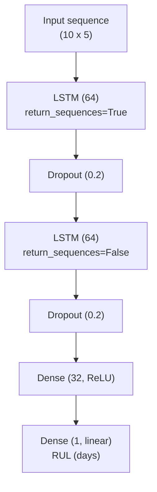
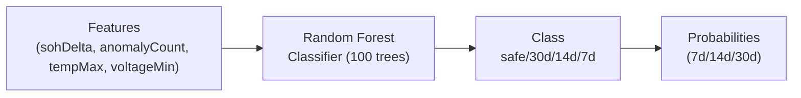
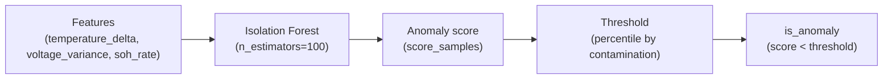

# ML Model Documentation (LSTM, RF, IF)

This document describes the ML models used for AI Insights:
- **RUL prediction (LSTM)**: sequence-to-regression model predicting Remaining Useful Life (days)
- **Predictive maintenance risk (Random Forest)**: multi-class classifier for failure risk windows (7d/14d/30d/safe)
- **Anomaly detection (Isolation Forest)**: unsupervised outlier detector for abnormal behavior patterns

## System Architecture

```mermaid
flowchart LR
  subgraph Data[Telemetry]
    S[Sensors / BMS] -->|time-series readings| B[(Backend DB)]
  end

  subgraph Inference[Inference + Decisions]
    M[MLOps Service (FastAPI)] -->|RUL + anomaly scoring| BE[Backend Service (API + Jobs)]
  end

  B -->|features / sequences| M
  BE -->|persisted predictions| B
  FE[Frontend] -->|API calls| BE
  BE -->|responses| FE
```

Notes:
- The **backend** persists predictions to `rul_predictions` and exposes product-facing APIs.
- The **mlops** service runs model inference (LSTM RUL, Isolation Forest anomalies) and exposes FastAPI endpoints.

## Models

### 1) RUL Prediction — LSTM (TensorFlow/Keras)

**Purpose**: Predict Remaining Useful Life (RUL) in **days** from a short sequence of recent measurements.

**Implementation**:
- Model: `services/ml/src/models/rul_lstm.py`
- Training script: `services/ml/train_rul_model.py`
- Inference service: `services/mlops/src/api/rul_service.py`, `services/mlops/src/api/routes.py`

**Inputs (per time step, in order)**:
1. `soc` (State of Charge, 0–100%)
2. `soh` (State of Health, 0–100%)
3. `temperature` (°C)
4. `voltage` (V)
5. `cycles` (integer cycle count)

**Input shape**: `(sequence_length=10, n_features=5)`

**Output**: `predicted_rul` (float days)

**Architecture (current default)**:
- 2× LSTM layers (64 units each), with dropout (0.2)
- Dense (32, ReLU)
- Dense (1, linear)



### 2) Predictive Maintenance Risk — Random Forest (TypeScript)

**Purpose**: Predict failure-risk window for a battery system:
- `safe`, `30d`, `14d`, `7d`

**Implementation**:
- Model: `services/backend/src/ml/predictiveMaintenanceModel.ts`
- API: `services/backend/src/routes/ml.ts`

**Feature vector (4 features, in order)**:
1. `sohDelta`: SoH degradation rate (%/day)
2. `anomalyCount`: anomaly count observed in recent window
3. `tempMax`: max temperature in recent window (°C)
4. `voltageMin`: min voltage in recent window (V)

**Architecture**:


### 3) Anomaly Detection — Isolation Forest (scikit-learn)

**Purpose**: Detect abnormal behavior patterns (temperature spikes, cell imbalance, abnormal aging).

**Implementation**:
- Detector: `services/ml/src/anomaly_detection/anomaly_detector.py`
- API: `services/mlops/src/api/anomaly.py`

**Feature vector (3 features, in order)**:
1. `temperature_delta` (°C/hour): rate of temperature change
2. `voltage_variance` (V²): variance across cell voltages
3. `soh_rate` (%/day): SoH change rate

**Architecture**:


## Feature Engineering

### A) LSTM sequence construction (RUL)

The RUL model expects a fixed-length sequence of the most recent `N=10` time steps.

Recommended approach:
1. Pull the last 10 readings for a battery system ordered by time ascending
2. Build `sequence: List[List[float]]` with feature order `[soc, soh, temperature, voltage, cycles]`
3. Reject/repair sequences that are not exactly length 10

### B) Predictive maintenance features (RF)

The backend scheduled job uses DB-derived aggregates (example location: `services/backend/src/services/scheduledPredictionJob.ts`):
- `tempMax`: `MAX(temperature)` in the last 24h window
- `voltageMin`: `MIN(voltage)` in the last 24h window
- `anomalyCount`: count of recent anomalies (stored/derived upstream)
- `sohDelta`: SoH degradation rate (stored/derived upstream)

If you compute these from raw readings:
- `tempMax = max(temperature over window)`
- `voltageMin = min(voltage over window)`
- `sohDelta = (soh_now - soh_prev) / days_between` (negative is degradation)

### C) Anomaly detection features (IF)

Typical derivations from time-series and per-pack/per-cell signals:
- `temperature_delta = (temp_t - temp_(t-1)) / hours_between`
- `voltage_variance = var(cell_voltage_1..cell_voltage_n)` at time `t`
- `soh_rate = (soh_t - soh_(t-k)) / days_between`

## Training Procedures

### 1) Train the RUL LSTM model (offline)

From `services/ml`:

```bash
cd services/ml
python train_rul_model.py
```

Artifacts (created by `services/ml/train_rul_model.py`):
- `services/ml/data/models/rul_lstm_model.h5`
- `services/ml/data/models/rul_lstm_model_metadata.json`

To use the trained model in `mlops`, copy the artifacts:

```bash
cp services/ml/data/models/rul_lstm_model.h5 services/mlops/models/
cp services/ml/data/models/rul_lstm_model_metadata.json services/mlops/models/
```

### 2) Train/retrain predictive maintenance RF (backend)

This model can be trained at runtime:
- Default training data is synthetic (failure scenarios) inside `services/backend/src/ml/predictiveMaintenanceModel.ts`
- Custom training data can be provided via API

API:
- `POST /api/v1/ml/train` (backend service)

### 3) Train anomaly detector (MLOps)

The anomaly API provides a simple training endpoint using synthetic data:
- `POST /api/v1/ml/train-anomaly` (mlops service)

Trained artifact:
- `services/mlops/data/models/anomaly_detector.joblib` (inside the mlops working directory/container)

## API Endpoints

### MLOps service (FastAPI, default port `8001`)

**Health**
- `GET /health`

**RUL prediction (LSTM)**
- `POST /ml/predict-rul`
- `GET /ml/model-info`

**Anomaly detection (Isolation Forest)**
- `POST /api/v1/ml/train-anomaly`
- `POST /api/v1/ml/detect-anomaly`
- `GET /api/v1/ml/anomaly-metrics`

### Backend service (Express, default port `3000`)

**Predictive maintenance (Random Forest)**
- `POST /api/v1/ml/predict-maintenance`
- `GET /api/v1/ml/model-metrics`
- `POST /api/v1/ml/train`

**RUL predictions persistence API**
- `GET /api/v1/predictions/:batteryId`
- `GET /api/v1/predictions/:batteryId/latest`
- `POST /api/v1/predictions`
- `DELETE /api/v1/predictions/cleanup`

## Example Usage

### 1) RUL prediction (curl)

```bash
curl -X POST http://localhost:8001/ml/predict-rul \
  -H "Content-Type: application/json" \
  -d '{
    "battery_system_id": "battery-uuid-123",
    "sequence": [
      [85.0, 92.5, 25.0, 3.85, 450],
      [80.0, 92.3, 26.0, 3.80, 451],
      [75.0, 92.1, 25.5, 3.75, 452],
      [90.0, 92.0, 24.0, 3.90, 453],
      [85.0, 91.8, 25.0, 3.85, 454],
      [80.0, 91.6, 26.0, 3.80, 455],
      [75.0, 91.4, 25.5, 3.75, 456],
      [90.0, 91.2, 24.0, 3.90, 457],
      [85.0, 91.0, 25.0, 3.85, 458],
      [80.0, 90.8, 26.0, 3.80, 459]
    ]
  }'
```

### 2) Anomaly detection (Python)

```python
import requests

resp = requests.post(
    "http://localhost:8001/api/v1/ml/detect-anomaly",
    json={
        "battery_system_id": "BAT-001",
        "features": {
            "temperature_delta": 0.5,
            "voltage_variance": 0.002,
            "soh_rate": 0.01,
        },
    },
    timeout=10,
)
resp.raise_for_status()
print(resp.json())
```

### 3) Predictive maintenance risk (Node/TypeScript)

```ts
const resp = await fetch("http://localhost:3000/api/v1/ml/predict-maintenance", {
  method: "POST",
  headers: {
    "Content-Type": "application/json",
    Authorization: `Bearer ${process.env.JWT_TOKEN}`,
  },
  body: JSON.stringify({
    batterySystemId: "battery-123",
    features: { sohDelta: -0.15, anomalyCount: 7, tempMax: 52, voltageMin: 3.1 },
  }),
});
console.log(await resp.json());
```

## Performance Benchmarks (Current Baselines)

These baselines come from existing implementation docs/tests and are primarily on synthetic/demo data:

### LSTM RUL (synthetic test set)
- MAE: **7.85 days**
- RMSE: **12.34 days**
- R²: **0.891**

Source: `T137_RUL_LSTM_IMPLEMENTATION.md`

### Random Forest risk model (synthetic scenarios)
- rocAuc7d/14d/30d: **1.0** (simplified AUC calculation)
- accuracy: **1.0**

Source: `T140_IMPLEMENTATION_COMPLETE.md`

### Isolation Forest anomaly detection (synthetic test set)
- precision: **1.00**
- recall: **0.85**
- f1_score: **0.92**
- API response time: avg **45ms** (demo environment)

Source: `T138_IMPLEMENTATION_COMPLETE.md`

## Limitations / Known Gaps

- **Synthetic training data**: All three models currently rely on synthetic or demo distributions; real-world performance will vary.
- **Metric simplifications**:
  - RF AUC-ROC is simplified in `services/backend/src/ml/predictiveMaintenanceModel.ts`.
  - LSTM confidence is currently a placeholder in `services/mlops/src/api/rul_service.py`.
- **Endpoint versioning inconsistency**: RUL endpoints are `/ml/*` while anomaly endpoints are `/api/v1/ml/*` in `services/mlops`.
- **Feature contribution for anomalies is heuristic**: `feature_contributions` are based on normalized absolute feature values (not true model explainability).

