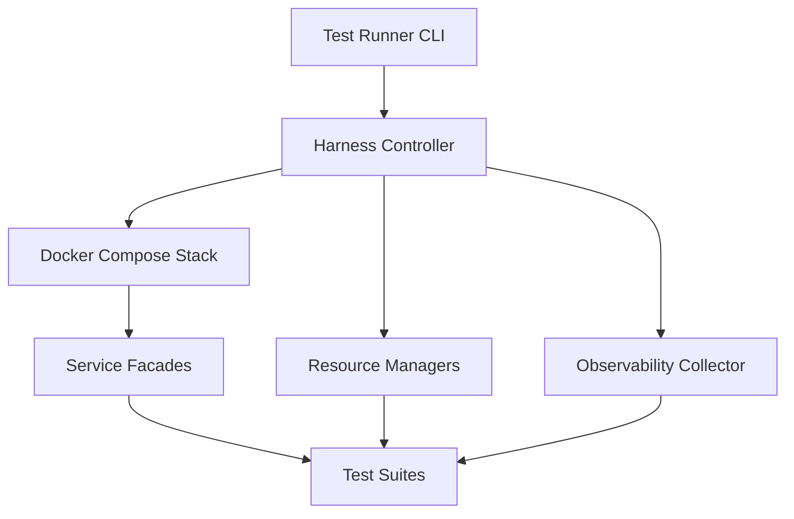

# Integration Test Infrastructure Plan

## Overview
- Purpose: translate the high-level guidance from [INTEGRATION_TEST_ARCHITECTURE_ANALYSIS.md](../INTEGRATION_TEST_ARCHITECTURE_ANALYSIS.md:1) and [INTEGRATION_TEST_STRATEGY.md](../INTEGRATION_TEST_STRATEGY.md:1) into an actionable infrastructure blueprint that spans all NT-POC services.
- Scope: Docker Compose-first execution environment (local + CI) that exercises backend, frontend, LINE Bot, MLOps, simulator, and shared data stores with deterministic data, controllable lifecycles, and reusable utilities.
- Outcomes:
  - Shared harness abstractions so every suite bootstraps containers, seeds datasets, acquires typed API clients, and manipulates scheduled jobs without duplicated plumbing.
  - Environment provisioning flows that ensure PostgreSQL/TimescaleDB, Redis, toxiproxy, and third-party mocks are ready before tests begin.
  - Evidence capture (logs, metrics, traces) for debugging failed integration runs.

## Harness Architecture
The harness is layered to isolate cross-cutting responsibilities and allow suites to opt into only what they need.

- **Execution Controller (Node 18+)**
  - Entry scripts under `tests/integration/system` orchestrate Docker Compose lifecycles via the Docker Engine API (through `dockerode`) and expose a `HarnessContext` to Vitest suites.
  - Controls profile selection (e.g., `with-redis`, `with-toxiproxy`) and ensures services pass health checks before tests run.

- **Service Facade Layer**
  - Typed HTTP clients (Supertest/httpx) wrap backend, MLOps, simulator, LINE Bot endpoints with shared auth/token injection.
  - Real-time helpers manage SSE and webhook simulations.

- **Resource Managers**
  - Database manager applies migrations (Knex CLI) and runs seed/reset scripts.
  - Job manager toggles cron intervals via env overrides and exposes REST hooks to trigger runs on demand.

- **Observability Collector**
  - Sidecar containers (Fluent Bit or Loki promtail) optional profile to centralize container logs.
  - Metrics polling module scrapes `/metrics` (backend) and `/ml/latency` (MLOps) to assert counters during tests.

### Service Coverage Matrix
| Layer | Backend | Frontend | LINE Bot | MLOps | Simulator | External Mocks |
| --- | --- | --- | --- | --- | --- | --- |
| Execution Controller | ✅ | ✅ (via proxy) | ✅ | ✅ | ✅ | ✅ |
| Service Facades | Supertest + MSW | Playwright bridge | Supertest | httpx/pytest | httpx/pytest | MSW/Responses |
| Resource Managers | Knex + custom scripts | N/A | N/A | Alembic hooks | Alembic hooks | Mock servers |

## Shared Utilities Catalog
| Utility | Purpose | Language | Target Path |
| --- | --- | --- | --- |
| `HarnessContext` | Central object exposing container controls, health waits, seeded data handles, and teardown hooks for Vitest suites. | TypeScript | [`tests/integration/shared/harnessContext.ts`](../../tests/integration/shared/harnessContext.ts:1) |
| `composeController` | Thin wrapper around Docker Compose CLI to up/down services, switch profiles, and stream logs for debugging. | TypeScript | [`tests/integration/shared/infra/composeController.ts`](../../tests/integration/shared/infra/composeController.ts:1) |
| `backendClient` | Supertest-based client with JWT helpers, retry policy, and typed route helpers for backend REST APIs. | TypeScript | [`tests/integration/shared/clients/backendClient.ts`](../../tests/integration/shared/clients/backendClient.ts:1) |
| `lineBotClient` | Simulates LINE webhook + notify flows with API key injection and signature signing utilities. | TypeScript | [`tests/integration/shared/clients/lineBotClient.ts`](../../tests/integration/shared/clients/lineBotClient.ts:1) |
| `mlopsClient` | httpx-based helper for FastAPI endpoints plus fixture upload for model files. | Python | [`tests/integration/python/clients/mlops_client.py`](../../tests/integration/python/clients/mlops_client.py:1) |
| `simulatorFixtures` | pytest fixtures that bootstrap simulator seeds, deterministic random sources, and API wrappers. | Python | [`tests/integration/python/fixtures/simulator_fixtures.py`](../../tests/integration/python/fixtures/simulator_fixtures.py:1) |
| `dataBuilders` | Factory helpers for facilities, battery systems, alerts, predictions, etc., ensuring referential integrity in tests. | TypeScript | [`tests/integration/shared/dataBuilders/index.ts`](../../tests/integration/shared/dataBuilders/index.ts:1) |
| `authHelpers` | JWT/API key issuers, clock skew simulators, and token invalidation utilities shared across suites. | TypeScript | [`tests/integration/shared/security/authHelpers.ts`](../../tests/integration/shared/security/authHelpers.ts:1) |
| `eventStreamHarness` | SSE subscription manager with latency assertions, reconnection logic, and payload snapshots. | TypeScript | [`tests/integration/realtime/eventStreamHarness.ts`](../../tests/integration/realtime/eventStreamHarness.ts:1) |
| `envOrchestrator` | Generates `.env.test` files per run, injects overrides (job intervals, mock URLs), and exposes metadata to suites. | TypeScript | [`tests/integration/shared/env/envOrchestrator.ts`](../../tests/integration/shared/env/envOrchestrator.ts:1) |
| `dbSnapshotManager` | CLI + library that captures, restores, and validates PostgreSQL snapshots for fast test resets. | TypeScript + Bash | [`tests/scripts/dbSnapshotManager.ts`](../../tests/scripts/dbSnapshotManager.ts:1) |
| `metricsProbe` | Polls Prometheus and FastAPI latency endpoints, exposes expect helpers to compare counter deltas. | TypeScript | [`tests/integration/shared/observability/metricsProbe.ts`](../../tests/integration/shared/observability/metricsProbe.ts:1) |

## Environment Provisioning Plan
1. **Compose Stack Definition**
   - Extend root [docker-compose.yml](../../docker-compose.yml:1) with `docker-compose.integration.yml` to add:
     - Integration-only networks (`bms-integration-net`), volumes for seeded DB snapshots, and optional services (toxiproxy, mock-server, fluent-bit).
     - Service profiles per test class: `core` (backend + db), `full-stack` (adds frontend + line-bot), `ml-suite` (adds mlops + simulator).

2. **Provisioning Workflow**
   - `tests/scripts/test-env-up.sh` executes `docker compose -f docker-compose.yml -f docker-compose.integration.yml --profile <profile> up -d --wait`.
   - Health gate: `HarnessContext.waitForHealth(service, endpoint, timeout)` polls `/health` endpoints.
   - `tests/scripts/test-env-down.sh` handles teardown with log archival (`docker compose logs > artifacts/<timestamp>`), volume pruning, and optional snapshot persistence.

3. **Configuration Injection**
   - `envOrchestrator` materializes `.env.integration` per service with deterministic values (ports, job intervals, mock URLs) and writes them into service-specific env files mounted via Compose.
   - Job intervals overridden to minutes fractions for fast execution (`PREDICTION_JOB_INTERVAL_MINUTES=0.1`).

4. **External Service Mocking**
   - Node-based mock service container (MSW CLI proxy) handles SendGrid, Mapbox, OpenWeather endpoints; toggled via `ENABLE_EXTERNAL_MOCKS=true`.
   - Toxiproxy container exposes programmable faults; harness attaches backend ↔ mlops/simulator connections through proxies when resilience tests run.

5. **CI Integration**
   - GitHub Actions job uses `actions/setup-node`, `docker/setup-buildx-action`, then invokes `npm run test:integration:setup` (wrapper for `test-env-up.sh`).
   - Cache docker layers and `~/.cache/pip` for Python clients.

## Data & State Management Strategy
- **Migrations & Seeds**
  - Compose entrypoint for PostgreSQL runs Knex migrations automatically; `HarnessContext.seedDatabase(seedProfile)` executes backend scripts (`npm run test:seed:minimal` by default) plus pyproject seeds for simulator/mlops.

- **Snapshotting**
  - Post-seed baseline snapshot captured via `dbSnapshotManager capture baseline` and stored under `tests/fixtures/db/base.dump`.
  - Each suite can `restore` snapshot before executing heavy scenarios to avoid repeated seeding.

- **Fixture Layers**
  - SQL fixtures for facilities/zones/battery systems under `tests/fixtures/sql/`.
  - JSON fixtures for SSE payload expectations and ML responses under `tests/fixtures/json/`.
  - Python fixtures deliver serialized model artifacts (LSTM, Isolation Forest) for deterministic inference.

- **Isolation & Resets**
  - Vitest suites wrap mutations in transactions via `HarnessContext.withTransaction(async ctx => { ... })`, rolling back after each test block.
  - For long-lived scenarios, call `dbSnapshotManager truncate --preserve=lookup_tables` followed by targeted seeds.

- **TimescaleDB Considerations**
  - Use deterministic timestamps (freeze clock via `luxon` + Jest fake timers) so hypertable chunk boundaries remain predictable.
  - Provide helper `insertSensorTimeseries` to batch insert sensor data using COPY for performance.

## Observability & Diagnostics Hooks
- **Metrics**
  - `metricsProbe` polls backend `/metrics` and validates counters for HTTP status, job execution, and SSE broadcasts.
  - For MLOps, collect latency histograms from `/ml/latency` and assert improvements/regressions.

- **Logging**
  - Compose routes `backend` and `line-bot` stdout to Fluent Bit container that writes structured logs into `artifacts/logs/*.json`. Harness attaches correlation IDs to every request via `X-Test-Run-Id` header for filtering.

- **Tracing**
  - Optional OpenTelemetry collector profile to capture spans emitted by backend. Tests can query collector API for `traceId` existence when verifying cross-service flows.

- **Failure Artifacts**
  - On Vitest failure hook, harness dumps:
    - Recent Compose logs (last 300 lines per service).
    - Database state snapshot (limited tables) for debugging.
    - SSE transcript from `eventStreamHarness`.

## Environment Provisioning Plan (Service Lifecycle Control)
- `composeController` exposes `startService(name)`, `stopService(name)`, `injectFault(service, scenario)` to let suites simulate outages without restarting the whole stack.
- Scheduled jobs toggled via backend admin endpoints (to be added) that accept `POST /internal/jobs/<name>/run-now` to trigger predictions/escalations deterministically.
- Frontend Playwright tests run against same stack by pointing Vite dev server to Compose network; harness ensures assets built once per suite.

## Data & State Management Strategy (Control Hooks)
- Provide `FixtureRegistry` mapping scenario names to builder pipelines, enabling suites to call `ctx.fixtures.load('alerts-critical-path')`.
- Implement `resetBetweenSuites` flag to automatically drop/restore DB snapshots, flush Redis, and clear simulator state.

## Observability & Diagnostics Hooks (Expanded)
- Expose `ctx.logs.stream(service, filter)` to stream logs during long-running tests (useful for SSE debugging).
- Provide `ctx.metrics.expectDelta(metricName, expectedDelta, { withinMs })` to assert job executions.

## Implementation Steps & Sequencing
1. **Scaffold Shared Directory Structure**
   - Create `tests/integration/shared`, `tests/integration/system`, `tests/integration/realtime`, and `tests/integration/python` folders with placeholder README.md files describing usage.
2. **Build Compose Overlay**
   - Author `docker-compose.integration.yml` + `.env.integration.example`; include optional services (toxiproxy, mock-server, fluent-bit, otel-collector).
3. **Implement Harness Core**
   - Deliver `HarnessContext`, `composeController`, `envOrchestrator`, and health-wait utilities. Provide Vitest setup file `tests/integration/setup.ts` to instantiate context.
4. **Seed Management**
   - Implement `dbSnapshotManager`, baseline seed scripts, and fixture registry linking SQL/JSON assets.
5. **Client Libraries & Builders**
   - Create typed clients for backend, LINE Bot, SSE harness, and Python httpx clients for mlops/simulator. Add data builders for facilities/alerts/predictions with TypeScript types shared from backend via generated SDK or `@nt-poc/backend-types` package.
6. **Observability Hooks**
   - Add metrics probe, log collector integration, and failure artifact exports.
7. **Service Lifecycle Controls**
   - Implement admin endpoints or CLI toggles for scheduled jobs; wire into harness job manager.
8. **Documentation & DX**
   - Update `tests/README.md` with run instructions, env matrix, and troubleshooting. Provide VS Code launch configs and npm scripts (e.g., `npm run test:integration`, `npm run test:integration:ml`, `npm run test:integration:realtime`).

Execution order ensures infrastructure exists before suites rely on it, aligning with Phase 1 priorities in the strategy doc.

## Risks / Open Questions
| Risk / Question | Impact | Mitigation / Next Step |
| --- | --- | --- |
| TimescaleDB snapshot size may slow CI restores. | Longer suite boot times. | Evaluate logical replication vs. table-level dumps; consider using `pg_dump --section=pre-data,data` filters per schema. |
| Scheduled job hooks currently absent in backend API. | Hard to trigger deterministic runs. | Add `/internal/jobs/run` endpoints guarded by shared secret exclusively for tests. |
| SSE harness may introduce flakes due to timing variance. | Reduced trust in realtime tests. | Enforce deterministic clock + heartbeat ack before assertions; allow configurable retry budget. |
| Docker Compose resource contention on CI runners with limited CPUs. | Slower runs or timeouts. | Provide slim images, disable frontend/headless Playwright suites when not under test, allow profile-based service exclusion. |
| External mocks diverging from provider contracts over time. | Tests may pass while production fails. | Run nightly canary suite against real providers (gated) and diff responses vs. mock snapshots. |
| Python + Node dependency management divergence. | Harder onboarding and reproducibility. | Document pinned versions in `tests/requirements.txt` and root `package.json` `engines`, plus `poetry.lock`/`requirements.lock` for Python helpers. |

---
