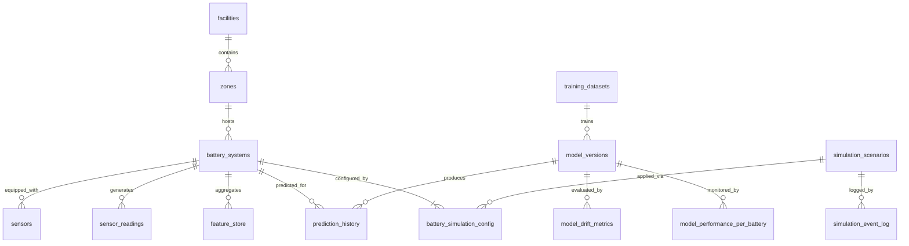

# 3D Battery Monitoring Schema Design

**Author**: Roo Architect Mode  
**Date**: 2026-01-17  
**Scope**: Extend the NT-POC database to support 3D spatial awareness, sensor simulation, and enhanced MLOps observability while remaining consistent with existing Knex/PostgreSQL conventions.

---

## 1. Schema Enhancements

### 1.1 `battery_systems` Additions
| Column | Type | Constraints / Notes |
| --- | --- | --- |
| position_x, position_y, position_z | `DECIMAL(10,4)` | Hard-defaulted to `0.0000` so each battery is stored at the shared global origin (0,0,0). UI/simulator layers may overlay relative offsets, but persisted values stay zero for backend, simulator, and MLOps alignment. |
| rotation_pitch, rotation_yaw, rotation_roll | `DECIMAL(6,2)` | Degrees (−180 to 180). Persisted default `0.00` (pitch/yaw/roll) to align with the shared origin; visual tools can temporarily apply offsets but should not write them back. |
| width_m, height_m, depth_m | `DECIMAL(6,3)` | Physical bounding box in meters. Defaults derived from model catalog. |
| rack_id | `VARCHAR(64)` | Logical rack/cabinet identifier scoped to zone. |
| bay_position | `VARCHAR(32)` | Slot label within rack/cabinet (e.g., `U12`, `Cab-A-02`). |
| display_color | `VARCHAR(7)` | Hex color `#RRGGBB` for UI. |
| icon_type | `VARCHAR(64)` | Symbol name (e.g., `battery_rack`, `floor_unit`). |
| model_3d_reference | `VARCHAR(255)` | URL or storage key to GLB/OBJ asset. |
| installation_date | `TIMESTAMPTZ` | Already present; reaffirm usage for lifecycle queries. |
| last_maintenance_date | `TIMESTAMPTZ` | New column for scheduling & visualization overlays. |

**Checks & Indexes**
- `CHECK (width_m > 0 AND height_m > 0 AND depth_m > 0)`
- Partial index `idx_battery_systems_zone_status_position` on `(zone_id, status, position_x, position_y)` for viewport slices.
- Unique `(zone_id, rack_id, bay_position)` where `rack_id IS NOT NULL` to avoid collisions.

### 1.2 `zones` Additions
| Column | Type | Constraints / Notes |
| --- | --- | --- |
| floor_level | `INTEGER` | 0 = ground, positive upwards, negative basement. |
| zone_width_m, zone_length_m, zone_height_m | `DECIMAL(8,2)` | Physical extents. |
| boundary_coordinates | `JSONB` | Array of `{x,y}` defining polygon footprint. Validate via CHECK using `jsonb_typeof`. |
| max_battery_capacity | `INTEGER` | Planning constraint for placement validation. |
| floor_plan_image_url | `VARCHAR(255)` | Reference to blueprint/floor image. |
| layout_type | `ENUM('rack','cabinet','floor')` | Default `rack`. |

**Indexes**
- `idx_zones_facility_floor` on `(facility_id, floor_level)` for stacking visualizations.
- `GIN` index on `boundary_coordinates` for containment queries.

---

## 2. Sensor Simulator Integration Schema

### 2.1 `sensor_types`
- `id UUID PK`
- `sensor_name VARCHAR(100)` unique
- `measurement_unit VARCHAR(16)`
- `min_value, max_value, typical_value DECIMAL(10,4)`
- `accuracy_percentage DECIMAL(5,2)`
- `sampling_rate_hz INTEGER`
- `description TEXT`
- `created_at TIMESTAMPTZ DEFAULT now()`

### 2.2 `sensors`
- `id UUID PK`
- `battery_system_id UUID FK → battery_systems(id) ON DELETE CASCADE`
- `sensor_type_id UUID FK → sensor_types(id)`
- `sensor_serial_number VARCHAR(64)` unique
- `position_on_battery VARCHAR(32)` (enum-like text: `top`, `side_1`, etc.)
- `status ENUM('active','inactive','faulty','calibrating') DEFAULT 'active'`
- `calibration_date TIMESTAMPTZ`
- `created_at`, `updated_at` TIMESTAMPTZ

### 2.3 `simulation_scenarios`
- `id UUID PK`
- `scenario_name VARCHAR(150)` unique
- `description TEXT`
- `base_noise_level DECIMAL(6,4)`
- `drift_rate DECIMAL(8,4)`
- `failure_probability DECIMAL(6,5)`
- `temperature_variance, voltage_variance, current_variance DECIMAL(10,4)`
- `soc_degradation_rate, soh_degradation_rate DECIMAL(8,4)`
- `is_active BOOLEAN DEFAULT true`
- Auditing timestamps

### 2.4 `battery_simulation_config`
- `id UUID PK`
- `battery_system_id UUID FK UNIQUE` (one config per system)
- `simulation_scenario_id UUID FK`
- `custom_noise_level DECIMAL(6,4)` nullable override
- `random_seed INTEGER`
- `start_time TIMESTAMPTZ`
- `end_time TIMESTAMPTZ`
- `is_active BOOLEAN DEFAULT false`
- `configuration_json JSONB`
- Index `(is_active, simulation_scenario_id)`

### 2.5 `simulation_event_log`
- `id UUID PK`
- `battery_system_id UUID FK`
- `event_type ENUM('scenario_changed','failure_injected','sensor_calibrated','config_updated')`
- `event_description TEXT`
- `previous_state JSONB`
- `new_state JSONB`
- `triggered_by VARCHAR(64)`
- `created_at TIMESTAMPTZ DEFAULT now()`
- Composite index `(battery_system_id, created_at DESC)`

---

## 3. Enhanced MLOps Schema

### 3.1 `feature_store`
- `id UUID PK`
- `battery_system_id UUID FK`
- `feature_timestamp TIMESTAMPTZ not null`
- Aggregated voltage/current/temperature stats (mean, std, min, max) as `DECIMAL(12,5)`
- `soc_trend, soh_trend DECIMAL(8,4)`
- `power_consumption_total DECIMAL(12,4)`
- `anomaly_score DECIMAL(6,4)`
- `feature_version VARCHAR(32)`
- `created_at TIMESTAMPTZ`
- Index `(battery_system_id, feature_timestamp)`
- Monthly partitioning by `feature_timestamp`

### 3.2 `model_versions`
- `id UUID PK`
- `model_name VARCHAR(120)`
- `version VARCHAR(32)` unique per name (enforce via partial unique index `(model_name, version)`)
- `framework VARCHAR(50)`
- `model_file_path VARCHAR(255)` (S3/MinIO key)
- `training_dataset_id UUID FK → training_datasets`
- `hyperparameters JSONB`
- `training_metrics JSONB`
- `validation_metrics JSONB`
- `deployed_at TIMESTAMPTZ`
- `is_active BOOLEAN`
- `created_by VARCHAR(120)`
- `created_at`, `updated_at`
- Index on `(model_name, is_active DESC)`

### 3.3 `training_datasets`
- `id UUID PK`
- `dataset_name VARCHAR(120)`
- `dataset_version VARCHAR(32)`
- `start_date, end_date TIMESTAMPTZ`
- `battery_system_ids JSONB` array of UUIDs
- `total_records INTEGER`
- `feature_columns JSONB`
- `target_column VARCHAR(64)`
- `storage_path VARCHAR(255)`
- `data_hash VARCHAR(128)`
- `created_at`
- Unique `(dataset_name, dataset_version)`

### 3.4 `prediction_history`
- `id UUID PK`
- `battery_system_id UUID FK`
- `model_version_id UUID FK`
- `prediction_timestamp TIMESTAMPTZ`
- `prediction_type ENUM('rul','anomaly','failure_mode')`
- `predicted_value DECIMAL(12,5)`
- `confidence_score DECIMAL(6,4)`
- `feature_values_snapshot JSONB`
- `prediction_metadata JSONB`
- `actual_value DECIMAL(12,5)` nullable
- `created_at TIMESTAMPTZ`
- Indexes `(battery_system_id, prediction_timestamp DESC)` and `(model_version_id, prediction_timestamp DESC)`
- Retain 180 days (see §6)

### 3.5 `model_drift_metrics`
- `id UUID PK`
- `model_version_id UUID FK`
- `battery_system_id UUID FK nullable`
- `metric_timestamp TIMESTAMPTZ`
- `drift_type ENUM('data_drift','concept_drift','prediction_drift')`
- `drift_score DECIMAL(6,4)`
- `metric_name VARCHAR(64)`
- `baseline_distribution JSONB`
- `current_distribution JSONB`
- `threshold_exceeded BOOLEAN`
- `alert_triggered BOOLEAN`
- `created_at TIMESTAMPTZ`
- Composite index `(model_version_id, metric_timestamp DESC)`

### 3.6 `model_performance_per_battery`
- `id UUID PK`
- `model_version_id UUID FK`
- `battery_system_id UUID FK`
- `evaluation_period_start`, `evaluation_period_end`
- `mae, rmse, r2_score DECIMAL(10,5)`
- `precision, recall, f1_score DECIMAL(6,5)` nullable
- `prediction_count INTEGER`
- `error_rate DECIMAL(6,5)`
- `performance_json JSONB`
- `created_at`
- Unique `(model_version_id, battery_system_id, evaluation_period_start)`

---

## 4. Relationships & ER Diagram

**Narrative**
- `facilities` 1→N `zones` (with floor metadata)
- `zones` 1→N `battery_systems`
- `battery_systems` 1→N `sensors`, 1→1 `battery_simulation_config`, 1→N `simulation_event_log`, 1→N `feature_store`, 1→N `prediction_history`
- `simulation_scenarios` referenced by configs and events
- `model_versions` ← `training_datasets`, and → `prediction_history`, `model_drift_metrics`, `model_performance_per_battery`

---

## 5. Indexing Strategy

| Table | Index | Purpose |
| --- | --- | --- |
| battery_systems | `btree(zone_id, status, position_x)` | Fast viewport querying per zone/status. |
| battery_systems | `btree(rack_id, bay_position)` (partial `rack_id IS NOT NULL`) | Collision-free slot lookup. |
| battery_systems | `gist(point(position_x, position_y))` (if PostGIS enabled) | 2D spatial proximity queries for collision detection. |
| zones | `btree(facility_id, floor_level)` | Filter zones per floor. |
| zones | `gin(boundary_coordinates jsonb_path_ops)` | Polygon containment lookup. |
| sensors | `btree(battery_system_id, status)` | Active sensor filtering. |
| sensor_types | `btree(sensor_name)` | Name lookups for API validation. |
| simulation_scenarios | `btree(is_active, scenario_name)` | Scenario pick-lists. |
| battery_simulation_config | `btree(is_active, simulation_scenario_id)` | Scheduler queries. |
| simulation_event_log | `btree(battery_system_id, created_at DESC)` | Audit trail per battery. |
| feature_store | `btree(feature_timestamp)` + monthly partitions | Time slicing for ML training. |
| prediction_history | `btree(battery_system_id, prediction_timestamp DESC)` | Recent predictions per asset. |
| model_versions | `btree(model_name, is_active)` | Deployment lookups. |
| JSONB columns | `gin(boundary_coordinates)`, `gin(configuration_json)`, `gin(feature_values_snapshot)` | Efficient JSON queries.

Time-series indexes on `sensor_readings`, `feature_store`, `prediction_history`, and `simulation_event_log` are aligned to `(battery_system_id, timestamp)` composites for time-window scans.

---

## 6. Data Retention & Partitioning

| Table | Retention Policy | Mechanism |
| --- | --- | --- |
| sensor_readings | 30 days raw | Convert to TimescaleDB hypertable partitioned daily; scheduled job `DELETE WHERE time < now() - interval '30 days'`. Aggregates preserved in `feature_store`. |
| prediction_history | 180 days | Monthly partitions, detach/archive partitions older than 6 months to cold storage. |
| simulation_event_log | 90 days | Weekly partitions, routine purge of inactive events beyond policy. |
| feature_store | 18 months | Monthly partitions retained for long-term ML training. |
| model_drift_metrics & model_performance_per_battery | 12 months | Keep for compliance & audits, using quarterly partitions. |

Partitioning plan leverages native PostgreSQL declarative partitioning or Timescale hypertables for `sensor_readings` and `feature_store` to maintain ingestion performance.

---

## 7. Shared-Origin Battery Layout

_All persisted placements are normalized_: every `battery_systems` row stores `position_x = position_y = position_z = 0.0000` and `rotation_pitch = rotation_yaw = rotation_roll = 0.00`. This shared origin keeps backend, simulator, and MLOps layers in lockstep while allowing clients to compose relative offsets in-memory.

**Why the origin lock matters**
- **Calibration simplicity**: A single origin solve aligns camera calibration, collision math, and simulator coordinate transforms, eliminating per-zone drift.
- **Simulator alignment**: Simulator workers derive rack/aisle offsets from `rack_id`, `bay_position`, and zone dimensions, but ingest/emit zeroed absolute coordinates so persisted telemetry always references the calibrated frame.
- **MLOps consistency**: Feature attribution, drift metrics, and replay pipelines treat spatial vectors as normalized; storing offsets externally avoids retraining whenever the physical layout shifts.
- **Auditability**: Persisted zeros mean migrations, seeds, and alignment scripts cannot diverge—any attempt to write non-zero coordinates is rejected and logged.

**Runtime offsets**
- **Frontend**: The viewport fetches origin-aligned payloads and applies deterministic rack templates or floor overlays before rendering or running collision checks. Relative offsets never persist.
- **Simulator**: Rack/bay offsets are injected into synthetic waveforms for fidelity, but writes back to `sensor_readings` remain zeroed, keeping playback synchronized.
- **Backend validation**: Seed scripts and database constraints must backfill historical rows to zero and raise exceptions if `position_*` or `rotation_*` deviate from the origin defaults.

Documented samples (tables, diagrams) should be interpreted as client-side overlays built from rack metadata, not persisted coordinates.

---

## 8. Migration Sequence

1. **20260117090000_add_zone_spatial_metadata.ts**
   - Add new columns to `zones`.
   - Backfill existing zones with default dimensions and floor levels.
2. **20260117090500_add_battery_systems_spatial_columns.ts**
   - Add 3D, orientation, visualization, and maintenance metadata.
   - Populate existing 5 batteries with interim coordinates.
3. **20260117091500_create_sensor_simulation_tables.ts**
   - Create `sensor_types`, `sensors`, `simulation_scenarios`, `battery_simulation_config`, `simulation_event_log`.
4. **20260117092000_enhance_mlops_tables.ts**
   - Create `feature_store`, `model_versions`, `training_datasets`, `prediction_history`, `model_drift_metrics`, `model_performance_per_battery`.
   - Add necessary FKs to existing prediction tables if needed.
5. **20260117093000_create_indexes_and_partitions.ts**
   - Convert `sensor_readings` to hypertable/partition.
   - Add indexes listed in §5, plus retention functions.
6. **20260117094000_seed_3d_battery_layout.ts**
   - Insert/Update 9 batteries with placement metadata, simulation defaults, and sample sensor configs.

Each migration follows existing `hasTable/hasColumn` guard patterns and ensures `down()` drops/rewinds objects in reverse order.

---

## 9. API Integration Patterns

### 3D Viewport Queries
1. **Zone Envelope**: `SELECT boundary_coordinates, zone_width_m, zone_length_m, zone_height_m FROM zones WHERE id = $1;`
2. **Battery Placements**: `SELECT id, position_x, position_y, position_z, rotation_pitch, rotation_yaw, rotation_roll, width_m, height_m, depth_m, display_color, icon_type, model_3d_reference FROM battery_systems WHERE zone_id = $1 AND status != 'offline';`
3. **Sensor Overlays**: Join `sensors` to overlay sensor status badges: `SELECT s.id, s.status, s.position_on_battery FROM sensors s WHERE s.battery_system_id = ANY($batteryIds);`

### Simulation Control
- Config endpoints read/write `battery_simulation_config` and append to `simulation_event_log` with `previous_state`/`new_state` JSON snapshots.
- Scenario catalogs served from `simulation_scenarios WHERE is_active = true ORDER BY scenario_name`.

### MLOps Dashboards
- Feature lineage: `SELECT fs.*, mv.model_name FROM feature_store fs JOIN model_versions mv ON fs.feature_version = mv.version WHERE fs.battery_system_id = $1 ORDER BY feature_timestamp DESC LIMIT 200;`
- Drift heatmaps: `SELECT metric_timestamp, drift_score FROM model_drift_metrics WHERE battery_system_id = $1 AND drift_type = 'data_drift';`

Frontend caches should leverage `(battery_system_id, timestamp)` indexes for pagination and time brushing.

---

## 10. Performance Considerations

1. **Spatial Queries**: 3D placement relies on numeric columns rather than JSON for easier indexing. Optional GiST/BRIN indexes enhance bounding-box checks.
2. **Time-series Ingestion**: Partitioning/hypertables maintain `sensor_readings` insert rate and enable quick purges aligned with the 30-day retention SLA.
3. **JSONB Fields**: Apply `jsonb_path_ops` GIN indexes for `boundary_coordinates`, `configuration_json`, `feature_values_snapshot` to keep query planner efficient.
4. **Materialized Aggregates**: `feature_store` captures rolling statistics, reducing downstream query cost for ML training and anomaly dashboards.
5. **Concurrency**: Simulation updates wrap config changes and event logging in transactions to keep audit trails synchronized.
6. **Data Quality Hooks**: Add triggers validating `position_x/y/z` fall within zone boundaries (`0 <= x <= zone_width_m`) to prevent invalid placements.
7. **Retention Automation**: Schedule PostgreSQL jobs (via `cron` or TimescaleDB actions) to enforce retention windows, minimizing manual intervention.

---

## Next Steps
1. Review this design with backend + ML teams for approval.
2. Generate migration stubs per sequence in §8.
3. Update seed scripts to include new battery placements, sensor catalogs, and baseline simulation scenarios.
4. Align API contracts with new tables (GraphQL/REST DTO updates) before implementation phase.
