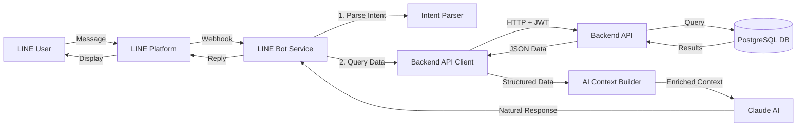

# LINE Bot Database Integration Plan

## Overview

This document outlines the plan to integrate the LINE Bot with the NT-POC backend database, enabling the bot to provide real-time battery management system data through natural language interactions powered by Claude AI.

## Current State Analysis

### LINE Bot Service (Port 3002)
- ✅ Running with Express.js
- ✅ Webhook endpoint configured (`/webhook`)
- ✅ Local Claude AI integrated (`localhost:4141`)
- ✅ LINE messaging API configured
- ❌ **No database integration** - only provides generic AI responses

### Backend API (Port 3000)
- ✅ PostgreSQL database with TimescaleDB
- ✅ RESTful API with authentication
- ✅ Multiple endpoints available:
  - [`/api/v1/facilities`](services/backend/src/routes/facilities.ts) - Facility management
  - [`/api/v1/alerts`](services/backend/src/routes/alerts.ts) - Alert management
  - [`/api/v1/battery-health`](services/backend/src/routes/batteryHealth.ts) - Battery health metrics
  - More endpoints: predictions, sensor readings, weather, etc.

### Authentication Requirements
- Backend uses JWT authentication
- All routes protected with [`authenticate`](services/backend/src/middleware/auth.ts:12) middleware
- Requires `Authorization: Bearer <token>` header
- Environment variable: `JWT_SECRET` (default: `'test-secret'`)

## Architecture Design

### Integration Strategy: **Backend API Client Pattern**



**Why Backend API vs Direct DB?**
- ✅ Maintains separation of concerns
- ✅ Reuses existing business logic and validation
- ✅ Respects authentication and authorization
- ✅ Easier to maintain and debug
- ✅ Backend handles connection pooling
- ❌ Direct DB requires duplicate logic and security management

## Implementation Plan

### Phase 1: Backend API Client Service

**File**: `services/line-bot/src/services/backendClient.ts`

**Responsibilities**:
- HTTP client with JWT authentication
- API endpoint wrappers for common queries
- Error handling and retry logic
- Response caching (optional)

**Key Methods**:
```typescript
class BackendApiClient {
  // Facilities
  getFacilities(): Promise<Facility[]>
  getFacility(id: string): Promise<Facility>
  getFacilityKpis(id: string): Promise<FacilityKpis>
  
  // Alerts
  getAlerts(filters?: AlertFilters): Promise<Alert[]>
  getAlertStats(): Promise<AlertStats>
  
  // Battery Health
  getBatteryHealthSummary(facilityId: string): Promise<HealthSummary>
  getAtRiskBatteries(facilityId: string): Promise<Battery[]>
  
  // System Overview
  getSystemOverview(): Promise<SystemOverview>
}
```

### Phase 2: Intent Parser & Command Router

**File**: `services/line-bot/src/services/intentParser.ts`

**Purpose**: Parse user messages to determine intent and extract parameters

**Example Intents**:
| User Message | Intent | Parameters |
|--------------|--------|------------|
| "What's the system status?" | `SYSTEM_STATUS` | - |
| "Show me alerts" | `LIST_ALERTS` | - |
| "Critical alerts only" | `LIST_ALERTS` | `{severity: 'critical'}` |
| "Status of Bangkok facility" | `FACILITY_STATUS` | `{facilityName: 'Bangkok'}` |
| "Which batteries are at risk?" | `AT_RISK_BATTERIES` | - |
| "/status" | `SYSTEM_STATUS` | - |
| "/alerts" | `LIST_ALERTS` | - |
| "/facility <name>" | `FACILITY_STATUS` | `{facilityName: name}` |

**Detection Strategy**:
1. Check for slash commands first (`/status`, `/alerts`, etc.)
2. Use Claude AI to parse natural language queries
3. Extract parameters using regex or AI parsing
4. Map to backend API calls

### Phase 3: Enhanced AI Context Builder

**File**: `services/line-bot/src/services/contextBuilder.ts`

**Purpose**: Fetch relevant data and structure it as context for Claude

**Flow**:
```typescript
async function buildContext(userMessage: string, intent: Intent) {
  const data = await fetchRelevantData(intent);
  const context = formatDataForAI(data);
  
  return {
    systemPrompt: "You are a BMS assistant with access to real-time data...",
    contextData: context,
    userMessage: userMessage
  };
}
```

**Example Context**:
```json
{
  "systemStatus": {
    "totalFacilities": 3,
    "activeFacilities": 3,
    "criticalAlerts": 2,
    "warningAlerts": 5
  },
  "recentAlerts": [
    {
      "id": "alert-1",
      "severity": "critical",
      "type": "Temperature High",
      "facility": "Bangkok Main",
      "createdAt": "2026-01-14T03:45:00Z"
    }
  ],
  "userQuery": "What's the current status?"
}
```

### Phase 4: Command Handlers

**File**: `services/line-bot/src/handlers/commandHandlers.ts`

**Handlers**:
```typescript
async function handleSystemStatus() {
  const facilities = await backendClient.getFacilities();
  const alerts = await backendClient.getAlertStats();
  // Build context and pass to AI
}

async function handleListAlerts(filters?: AlertFilters) {
  const alerts = await backendClient.getAlerts(filters);
  // Format and return via AI
}

async function handleFacilityStatus(facilityName: string) {
  const facility = await findFacilityByName(facilityName);
  const kpis = await backendClient.getFacilityKpis(facility.id);
  const health = await backendClient.getBatteryHealthSummary(facility.id);
  // Build comprehensive context
}

async function handleAtRiskBatteries() {
  const facilities = await backendClient.getFacilities();
  const atRiskByFacility = await Promise.all(
    facilities.map(f => backendClient.getAtRiskBatteries(f.id))
  );
  // Aggregate and format
}
```

### Phase 5: Update LINE Bot Service

**File**: `services/line-bot/src/services/lineBot.ts`

**Changes**:
```typescript
async handleEvent(event: WebhookEvent): Promise<void> {
  if (event.type === 'message' && event.message.type === 'text') {
    const userMessage = event.message.text;
    
    // 1. Parse intent
    const intent = await intentParser.parse(userMessage);
    
    // 2. Fetch relevant data
    const data = await fetchDataForIntent(intent);
    
    // 3. Build AI context with real data
    const context = contextBuilder.build(userMessage, data);
    
    // 4. Generate AI response with context
    const aiResponse = await aiResponseService.generateResponse(
      userMessage,
      context
    );
    
    // 5. Reply to user
    await this.client.replyMessage({
      replyToken: event.replyToken,
      messages: [{ type: 'text', text: aiResponse }],
    });
  }
}
```

## Configuration Updates

### Environment Variables

**File**: `services/line-bot/.env`

```bash
# Existing
LINE_CHANNEL_SECRET=e8e575a17c9847b835ff53e9ea81b7fd
LINE_CHANNEL_ACCESS_TOKEN=VAsp...lFU=
AI_BASE_URL=http://localhost:4141/v1
AI_MODEL=claude-sonnet-4.5

# New - Backend Integration
BACKEND_API_URL=http://localhost:3000
BACKEND_API_KEY=test-jwt-token-here
JWT_SECRET=test-secret
```

### JWT Token Generation

For local development, generate a test JWT token:

```typescript
import jwt from 'jsonwebtoken';

const token = jwt.sign(
  { userId: 'line-bot', role: 'service' },
  'test-secret',  // Must match backend JWT_SECRET
  { expiresIn: '365d' }
);

console.log('JWT Token:', token);
// Add to .env as BACKEND_API_KEY
```

## Implementation Details

### 1. Backend API Client

**Features**:
- Automatic JWT token inclusion
- Request timeout handling
- Error response parsing
- Response typing with TypeScript interfaces
- Connection retry with exponential backoff

**Example Implementation**:
```typescript
import axios, { AxiosInstance } from 'axios';

export class BackendApiClient {
  private client: AxiosInstance;
  
  constructor() {
    this.client = axios.create({
      baseURL: process.env.BACKEND_API_URL || 'http://localhost:3000',
      timeout: 10000,
      headers: {
        'Authorization': `Bearer ${process.env.BACKEND_API_KEY}`,
        'Content-Type': 'application/json'
      }
    });
  }
  
  async getFacilities(): Promise<Facility[]> {
    const response = await this.client.get('/api/v1/facilities');
    return response.data.data;
  }
  
  async getAlerts(filters?: AlertFilters): Promise<Alert[]> {
    const params = new URLSearchParams();
    if (filters?.severity) params.append('severity', filters.severity);
    if (filters?.status) params.append('status', filters.status);
    
    const response = await this.client.get(`/api/v1/alerts?${params}`);
    return response.data.data;
  }
}
```

### 2. Intent Detection with AI

**Approach**: Use Claude AI itself to parse intent

```typescript
async parseIntent(message: string): Promise<Intent> {
  const prompt = `
Analyze this user message and extract the intent and parameters.

Message: "${message}"

Possible intents:
- SYSTEM_STATUS: Overall system status
- LIST_ALERTS: Show alerts (optionally filtered)
- FACILITY_STATUS: Status of specific facility
- AT_RISK_BATTERIES: Show batteries with low health
- BATTERY_HEALTH: Battery health information
- GENERAL_QUERY: Other questions

Return JSON: { "intent": "...", "parameters": {...} }
  `;
  
  const response = await aiService.generateResponse(prompt);
  return JSON.parse(response);
}
```

### 3. Data Formatting for AI

**Convert API responses to natural language context**:

```typescript
function formatAlertsForAI(alerts: Alert[]): string {
  if (alerts.length === 0) return "No active alerts.";
  
  const critical = alerts.filter(a => a.severity === 'critical');
  const warning = alerts.filter(a => a.severity === 'warning');
  
  let context = `Alert Summary:\n`;
  context += `- Critical: ${critical.length}\n`;
  context += `- Warning: ${warning.length}\n`;
  
  if (critical.length > 0) {
    context += `\nCritical Alerts:\n`;
    critical.forEach(a => {
      context += `  - ${a.type}: ${a.message}\n`;
    });
  }
  
  return context;
}
```

## Example User Interactions

### Scenario 1: System Overview

**User**: "What's the current status?"

**Bot Process**:
1. Parse intent: `SYSTEM_STATUS`
2. Fetch: facilities, alert stats, battery health summary
3. Build context with real data
4. Claude generates natural response

**Bot Response**:
```
System Status Overview 📊

Facilities: 3 active
- Bangkok Main: Healthy ✅
- Chiang Mai North: 2 warnings ⚠️
- Phuket Solar: Healthy ✅

Alerts: 7 total
- Critical: 2 🔴
- Warning: 5 ⚠️

Battery Health: 94% average
- 2 batteries require attention

Would you like details on the critical alerts?
```

### Scenario 2: Alert Query

**User**: "Show critical alerts"

**Bot Process**:
1. Parse intent: `LIST_ALERTS` with filter `{severity: 'critical'}`
2. Fetch: filtered alerts
3. Format with timestamps and facility info

**Bot Response**:
```
Critical Alerts 🔴

1. Temperature High - Bangkok Main
   Battery: BS-001, Zone A
   Created: 12 minutes ago
   Value: 45.2°C (threshold: 40°C)

2. Voltage Anomaly - Chiang Mai North
   Battery: BS-015, Zone B
   Created: 1 hour ago
   Voltage: 4.5V (expected: 3.6-4.2V)

Type /alert <number> for details or /ack <number> to acknowledge.
```

### Scenario 3: Facility Details

**User**: "/facility Bangkok"

**Bot Process**:
1. Parse command: `FACILITY_STATUS`, parameter: `{name: 'Bangkok'}`
2. Search facilities for match
3. Fetch: facility KPIs, battery health, recent alerts
4. Comprehensive report

**Bot Response**:
```
Bangkok Main Facility 🏭

Location: Bangkok, Thailand
Coordinates: 13.7563°N, 100.5018°E

⚡ Power Status
- Total Capacity: 5,000 kWh
- Current Power: 1,250 kW
- Average SOC: 78%

🔋 Battery Health
- Average SOH: 92%
- Healthy: 45 batteries
- Warning: 3 batteries
- At Risk: 2 batteries

⚠️ Active Alerts: 2 critical, 3 warnings

Use /health Bangkok for detailed health report.
```

## Testing Strategy

### Unit Tests
- Backend client API calls (mock axios)
- Intent parser accuracy
- Context builder formatting
- Command handlers logic

### Integration Tests
1. Start backend API locally
2. Generate test JWT token
3. Test backend client against real API
4. Verify data flow: API → Client → Context → AI

### End-to-End Tests
1. Start backend API
2. Start LINE Bot service
3. Use LINE Bot Simulator or test account
4. Send test messages
5. Verify responses contain real data

### Test Scenarios
```typescript
describe('LINE Bot Database Integration', () => {
  it('should fetch facilities from backend', async () => {
    const facilities = await backendClient.getFacilities();
    expect(facilities).toBeInstanceOf(Array);
  });
  
  it('should parse status query intent', async () => {
    const intent = await intentParser.parse("What's the status?");
    expect(intent.type).toBe('SYSTEM_STATUS');
  });
  
  it('should build context with real data', async () => {
    const context = await contextBuilder.build('Show alerts', {
      alerts: mockAlerts
    });
    expect(context).toContain('Alert Summary');
  });
});
```

## Security Considerations

### Authentication
- ✅ JWT token stored in environment variable
- ✅ Token expires after configured period
- ✅ Backend validates token on every request
- ⚠️ For production: use secure token rotation

### Data Access
- LINE Bot has read-only access via API
- No direct database manipulation
- All queries go through backend business logic
- Backend enforces authorization rules

### Secrets Management
- Never commit JWT tokens to git
- Use different tokens for dev/staging/prod
- Rotate tokens regularly in production
- Consider using secret managers (e.g., AWS Secrets Manager)

### Rate Limiting
- Implement rate limiting on backend API
- Cache frequently requested data in LINE Bot
- Avoid excessive API calls per user message

## Performance Optimization

### Caching Strategy
```typescript
class CachedBackendClient {
  private cache = new Map<string, { data: any; expiry: number }>();
  private CACHE_TTL = 60000; // 60 seconds
  
  async getFacilities(): Promise<Facility[]> {
    const cached = this.cache.get('facilities');
    if (cached && Date.now() < cached.expiry) {
      return cached.data;
    }
    
    const data = await this.backendClient.getFacilities();
    this.cache.set('facilities', {
      data,
      expiry: Date.now() + this.CACHE_TTL
    });
    return data;
  }
}
```

### Parallel Queries
```typescript
// Fetch related data in parallel
const [facilities, alerts, health] = await Promise.all([
  backendClient.getFacilities(),
  backendClient.getAlertStats(),
  backendClient.getBatteryHealthSummary(facilityId)
]);
```

### Response Time Targets
- Intent parsing: < 200ms
- Backend API call: < 500ms
- AI response generation: < 2s
- Total response time: < 3s

## Monitoring & Logging

### Logging Points
```typescript
logger.info('LINE message received', { userId, message });
logger.info('Intent parsed', { intent, parameters });
logger.info('Backend API called', { endpoint, duration });
logger.info('AI response generated', { messageLength, duration });
logger.error('Backend API error', { error, endpoint });
```

### Metrics to Track
- Total messages received
- Intent distribution
- Backend API response times
- API error rates
- AI response times
- User satisfaction (based on follow-up questions)

## Deployment Considerations

### Local Development
```bash
# Terminal 1: Start backend
cd services/backend
npm run dev

# Terminal 2: Start LINE Bot with DB integration
cd services/line-bot
npm run dev

# Terminal 3: Expose with ngrok
ngrok http 3002
```

### Kubernetes Deployment
- LINE Bot pod needs network access to backend service
- Use Kubernetes service discovery: `http://backend-service:3000`
- JWT token stored in Kubernetes secrets
- Environment-specific configuration via ConfigMaps

### Environment Variables per Environment

**Development**:
```bash
BACKEND_API_URL=http://localhost:3000
BACKEND_API_KEY=<dev-jwt-token>
```

**Staging**:
```bash
BACKEND_API_URL=http://backend-service:3000
BACKEND_API_KEY=<staging-jwt-token>
```

**Production**:
```bash
BACKEND_API_URL=https://api.nt-bms.com
BACKEND_API_KEY=<prod-jwt-token-from-secret>
```

## Rollout Plan

### Phase 1: Foundation (Week 1)
- [x] Analyze backend API structure
- [ ] Create backend API client service
- [ ] Implement JWT authentication
- [ ] Test connectivity to backend
- [ ] Document API client usage

### Phase 2: Intent & Context (Week 1)
- [ ] Implement intent parser
- [ ] Create context builder
- [ ] Add data formatting utilities
- [ ] Unit tests for parsers

### Phase 3: Command Handlers (Week 2)
- [ ] Implement system status handler
- [ ] Implement alert query handler
- [ ] Implement facility status handler
- [ ] Implement battery health handler
- [ ] Add error handling

### Phase 4: Integration (Week 2)
- [ ] Update LINE Bot service
- [ ] Connect all components
- [ ] Integration testing
- [ ] Performance optimization

### Phase 5: Testing & Documentation (Week 3)
- [ ] Comprehensive testing
- [ ] Update user documentation
- [ ] Create operator guide
- [ ] Performance benchmarking

### Phase 6: Deployment (Week 3)
- [ ] Deploy to staging
- [ ] User acceptance testing
- [ ] Deploy to production
- [ ] Monitor and iterate

## Success Criteria

✅ **Technical Success**:
- LINE Bot can fetch data from backend API
- Response times < 3 seconds
- Error rate < 1%
- All command handlers working
- Proper authentication and authorization

✅ **User Success**:
- Users can query system status
- Users can view alerts
- Users can check facility details
- Users can find at-risk batteries
- Natural language queries work correctly

✅ **Operational Success**:
- Monitoring and logging in place
- Documentation complete
- Deployment automated
- Team trained on system

## Next Steps

1. **Review this plan** with stakeholders
2. **Validate backend API accessibility** - ensure JWT can be generated
3. **Start Phase 1 implementation** - create backend client
4. **Set up test environment** - backend + LINE Bot running
5. **Implement iteratively** - one command handler at a time

## Questions for Stakeholder

1. **Backend Access**: Do you have the backend running locally? Can you generate a JWT token?
2. **Priority Features**: Which commands are most important? (status, alerts, health?)
3. **Response Format**: Do you prefer structured responses or natural language?
4. **Deployment Timeline**: When do you need this in production?
5. **Testing Access**: Do you have a LINE test account for testing?

---

**Document Version**: 1.0  
**Created**: 2026-01-14  
**Author**: Kilo Code Architect  
**Status**: Ready for Review