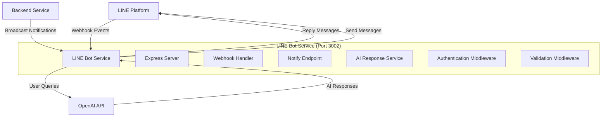

# LINE Bot Local Development Setup Plan

## Overview

This plan provides a comprehensive guide to set up and test the LINE Bot service locally, ensuring it works perfectly before deployment.

## Service Architecture



## Current Service Status

**Technology Stack:**
- Runtime: Node.js 18+
- Language: TypeScript (ES Modules)
- Framework: Express.js
- LINE SDK: @line/bot-sdk v10.5.0
- AI: OpenAI GPT-3.5-turbo
- Logger: Winston
- Security: Helmet + CORS

**Endpoints:**
- `GET /health` - Health check (public)
- `POST /webhook` - LINE webhook (LINE signature verified)
- `POST /notify` - Broadcast messages (API key protected)

**Key Features:**
- ✅ LINE signature verification
- ✅ API key authentication for broadcasts
- ✅ Input validation (message length, type)
- ✅ AI-powered responses via OpenAI
- ✅ Comprehensive logging
- ✅ Security headers (Helmet)
- ✅ Message sanitization

## Prerequisites Checklist

### Required Software
- [ ] Node.js >= 18.0.0 installed
- [ ] npm >= 7.0.0 installed
- [ ] curl or Postman for API testing
- [ ] Text editor (VS Code recommended)

### Required Accounts & Credentials
- [ ] LINE Developers account (https://developers.line.biz/console/)
- [ ] OpenAI API account (https://platform.openai.com/)
- [ ] ngrok account (for webhook testing) - Optional but recommended

### Verification Commands
```bash
# Check Node.js version
node --version  # Should be >= 18.0.0

# Check npm version
npm --version   # Should be >= 7.0.0

# Check if services are available
curl --version
```

## Step-by-Step Setup Plan

### Step 1: Get LINE API Credentials

**Actions:**
1. Go to [LINE Developers Console](https://developers.line.biz/console/)
2. Create a new Provider (or select existing)
3. Create a new Messaging API Channel
4. Configure the channel:
   - Channel name: "NT-POC Battery Monitor Bot" (or your choice)
   - Channel description: "Battery Management System notifications"
   - Category: Business
5. Go to "Messaging API" tab
6. Issue Channel Access Token (long-lived)
7. Copy the token
8. Go to "Basic settings" tab
9. Copy the Channel Secret

**Expected Output:**
- `LINE_CHANNEL_ACCESS_TOKEN`: Long string starting with specific characters
- `LINE_CHANNEL_SECRET`: 32-character hexadecimal string

### Step 2: Get OpenAI API Key

**Actions:**
1. Go to [OpenAI Platform](https://platform.openai.com/api-keys)
2. Sign in or create account
3. Click "Create new secret key"
4. Name it: "NT-POC LINE Bot"
5. Copy the key immediately (shown only once)
6. Verify billing/credits are set up

**Expected Output:**
- `OPENAI_API_KEY`: String starting with "sk-"

### Step 3: Environment Configuration

**File: `services/line-bot/.env`**

```bash
# Navigate to LINE bot directory
cd services/line-bot

# Copy example environment file
cp .env.example .env

# Generate API secret key
openssl rand -hex 32

# Edit .env file with your credentials
nano .env  # or use your preferred editor
```

**Required Configuration:**
```env
# LINE Messaging API Credentials
LINE_CHANNEL_ACCESS_TOKEN=<your_line_channel_access_token>
LINE_CHANNEL_SECRET=<your_line_channel_secret>

# OpenAI API Configuration
OPENAI_API_KEY=<your_openai_api_key>
OPENAI_MODEL=gpt-3.5-turbo

# Server Configuration
PORT=3002
NODE_ENV=development

# Logging
LOG_LEVEL=debug

# Security - Generate with: openssl rand -hex 32
API_SECRET_KEY=<your_generated_secret_key>

# CORS Configuration
ALLOWED_ORIGINS=http://localhost:3000,http://localhost:3001,http://localhost:3002

# Feature Flags
ENABLE_AI_RESPONSES=true

# Backend API Configuration (optional for now)
BACKEND_API_URL=http://localhost:3000
```

**Validation:**
```bash
# Check .env file exists and has content
cat .env | grep -v "^#" | grep -v "^$"
```

### Step 4: Install Dependencies

**Commands:**
```bash
# Ensure you're in the line-bot directory
cd services/line-bot

# Install dependencies
npm install

# Verify installation
npm list --depth=0
```

**Expected Output:**
```
line-bot@1.0.0
├── @line/bot-sdk@10.5.0
├── cors@2.8.5
├── dotenv@16.3.1
├── express@4.18.2
├── helmet@7.1.0
├── openai@6.16.0
└── winston@3.19.0
```

**Verify TypeScript Build:**
```bash
# Build the project
npm run build

# Check dist directory created
ls -la dist/
```

**Expected Output:**
- `dist/` directory created
- Compiled JavaScript files present
- No TypeScript errors

### Step 5: Start Development Server

**Commands:**
```bash
# Start in development mode (with hot reload)
npm run dev
```

**Expected Output:**
```
[INFO] Line Bot Service running on port 3002
```

**Verification:**
- Server starts without errors
- No missing environment variable warnings (except BACKEND_API_URL)
- Winston logger initialized
- Express listening on port 3002

### Step 6: Test Health Endpoint

**Purpose:** Verify service is running correctly

**Test Command:**
```bash
curl http://localhost:3002/health
```

**Expected Response:**
```json
{
  "status": "ok",
  "service": "line-bot"
}
```

**Success Criteria:**
- HTTP 200 status
- JSON response with correct structure
- Response time < 100ms

### Step 7: Test Broadcast Endpoint (Authentication)

**Test 1: Without API Key (Should Fail)**
```bash
curl -X POST http://localhost:3002/notify \
  -H "Content-Type: application/json" \
  -d '{"message": "Test notification"}'
```

**Expected Response:**
```json
{
  "status": "error",
  "message": "API key required"
}
```
- HTTP 401 status
- Warning logged

**Test 2: With Invalid API Key (Should Fail)**
```bash
curl -X POST http://localhost:3002/notify \
  -H "Content-Type: application/json" \
  -H "x-api-key: wrong_key" \
  -d '{"message": "Test notification"}'
```

**Expected Response:**
```json
{
  "status": "error",
  "message": "Invalid API key"
}
```
- HTTP 401 status
- Warning logged with IP

**Test 3: With Valid API Key (Should Succeed)**
```bash
curl -X POST http://localhost:3002/notify \
  -H "Content-Type: application/json" \
  -H "x-api-key: YOUR_API_SECRET_KEY_FROM_ENV" \
  -d '{"message": "Test notification from local dev 🚀"}'
```

**Expected Response:**
```json
{
  "status": "success",
  "message": "Broadcast sent successfully"
}
```
- HTTP 200 status
- Info logged
- Message sent to LINE (check LINE app if you're a follower)

### Step 8: Test Input Validation

**Test 1: Missing Message**
```bash
curl -X POST http://localhost:3002/notify \
  -H "Content-Type: application/json" \
  -H "x-api-key: YOUR_API_SECRET_KEY" \
  -d '{}'
```

**Expected:** HTTP 400, "Message is required"

**Test 2: Empty Message**
```bash
curl -X POST http://localhost:3002/notify \
  -H "Content-Type: application/json" \
  -H "x-api-key: YOUR_API_SECRET_KEY" \
  -d '{"message": ""}'
```

**Expected:** HTTP 400, "Message cannot be empty"

**Test 3: Message Too Long**
```bash
# Generate 5001 character message
python3 -c "print('A' * 5001)" > /tmp/long_message.txt

curl -X POST http://localhost:3002/notify \
  -H "Content-Type: application/json" \
  -H "x-api-key: YOUR_API_SECRET_KEY" \
  -d "{\"message\": \"$(cat /tmp/long_message.txt)\"}"
```

**Expected:** HTTP 400, "Message too long"

### Step 9: Set Up ngrok for Webhook Testing

**Why ngrok?**
LINE requires HTTPS webhooks. ngrok provides a secure tunnel from the internet to your localhost.

**Installation:**
```bash
# Option 1: npm (recommended)
npm install -g ngrok

# Option 2: Homebrew (macOS)
brew install ngrok

# Option 3: Download from https://ngrok.com/download
```

**Configuration:**
```bash
# Sign up at https://dashboard.ngrok.com/signup
# Get your authtoken from https://dashboard.ngrok.com/get-started/your-authtoken

# Configure ngrok with your authtoken
ngrok config add-authtoken YOUR_NGROK_AUTHTOKEN
```

**Start ngrok:**
```bash
# Start tunnel to port 3002
ngrok http 3002
```

**Expected Output:**
```
ngrok

Session Status                online
Account                       your_email@example.com
Version                       3.x.x
Region                        Asia Pacific (ap)
Latency                       -
Web Interface                 http://127.0.0.1:4040
Forwarding                    https://abc123.ngrok.io -> http://localhost:3002

Connections                   ttl     opn     rt1     rt5     p50     p90
                              0       0       0.00    0.00    0.00    0.00
```

**Important:** Copy the HTTPS URL (e.g., `https://abc123.ngrok.io`)

### Step 10: Configure LINE Webhook

**Actions:**
1. Go to [LINE Developers Console](https://developers.line.biz/console/)
2. Select your channel
3. Go to "Messaging API" tab
4. Find "Webhook settings" section
5. Set Webhook URL: `https://YOUR_NGROK_URL/webhook`
   - Example: `https://abc123.ngrok.io/webhook`
6. Click "Update"
7. Click "Verify" button
8. Enable "Use webhook"

**Expected Result:**
- Verification succeeds (shows success message)
- Webhook status shows "Enabled"
- Check your terminal/logs for incoming verification request

### Step 11: Test LINE Integration

**Test 1: Add Bot as Friend**
1. Go to "Messaging API" tab in LINE Console
2. Find QR code or Bot ID
3. Add bot as friend using LINE app
4. Check logs for follow event

**Expected Logs:**
```
[INFO] New follower: U1234567890abcdef...
```

**Test 2: Send Text Message**
1. Open chat with bot in LINE app
2. Send: "Hello"
3. Wait for AI response (3-5 seconds)

**Expected:**
- Message received in logs
- OpenAI API called
- AI response generated
- Reply sent to LINE
- Response appears in LINE chat

**Test 3: Ask About System**
Send: "What is the battery system status?"

**Expected:**
- AI provides contextual response about battery monitoring
- Response is concise and chat-friendly
- Response time < 10 seconds

### Step 12: Test Error Handling

**Test 1: Invalid OpenAI Key**
1. Temporarily set wrong OPENAI_API_KEY in .env
2. Restart server
3. Send message via LINE
4. Check for fallback response

**Expected:**
- Error logged
- Fallback message sent: "I encountered an error while processing your request. Please try again later."
- Service continues running

**Test 2: Invalid LINE Credentials**
1. Temporarily set wrong LINE_CHANNEL_ACCESS_TOKEN
2. Restart server
3. Try broadcast via API

**Expected:**
- Warning logged about missing/invalid token
- Broadcast skipped gracefully
- Service continues running

### Step 13: Monitor and Verify Logs

**Log Verification:**
```bash
# Watch logs in real-time
npm run dev

# Or if using PM2
pm2 logs line-bot

# Check for:
# - INFO: Service startup
# - INFO: Successful API calls
# - WARN: Authentication failures
# - ERROR: Failed operations
```

**Expected Log Patterns:**
```
[INFO] Line Bot Service running on port 3002
[INFO] Broadcasting message to LINE followers
[INFO] New follower: U1234567890...
[WARN] API request without API key
[ERROR] Error generating AI response: ...
```

## Testing Checklist

### Basic Functionality
- [ ] Service starts without errors
- [ ] Health endpoint returns 200
- [ ] Environment variables loaded correctly
- [ ] TypeScript compiles without errors

### Authentication & Security
- [ ] Requests without API key are rejected (401)
- [ ] Requests with invalid API key are rejected (401)
- [ ] Requests with valid API key succeed (200)
- [ ] Security headers present (Helmet)
- [ ] CORS configured correctly

### Input Validation
- [ ] Empty messages rejected
- [ ] Messages over 5000 chars rejected
- [ ] Non-string messages rejected
- [ ] Valid messages accepted
- [ ] Message sanitization works

### LINE Integration
- [ ] Webhook verification succeeds
- [ ] Follow events received and logged
- [ ] Text messages received
- [ ] Replies sent successfully
- [ ] LINE signature verification works

### AI Responses
- [ ] OpenAI API calls succeed
- [ ] Responses generated in < 10 seconds
- [ ] Responses are contextual
- [ ] Error handling works (fallback responses)
- [ ] Rate limits respected

### Error Handling
- [ ] Invalid credentials handled gracefully
- [ ] Network errors logged properly
- [ ] Service continues after errors
- [ ] Fallback responses provided

### Logging
- [ ] All log levels work (debug, info, warn, error)
- [ ] Structured logging format
- [ ] Sensitive data not logged
- [ ] Request/response logged appropriately

## Common Issues and Solutions

### Issue 1: "LINE Channel Access Token missing"

**Symptom:** Service starts but shows warning about missing token

**Solution:**
```bash
# Check .env file exists
ls -la .env

# Check token is set
grep LINE_CHANNEL_ACCESS_TOKEN .env

# Verify no extra spaces or quotes
# Should be: LINE_CHANNEL_ACCESS_TOKEN=your_token_here
```

### Issue 2: "Port 3002 already in use"

**Symptom:** Service fails to start

**Solution:**
```bash
# Find process using port 3002
lsof -i :3002

# Kill the process
kill -9 <PID>

# Or use different port
PORT=3003 npm run dev
```

### Issue 3: Webhook verification fails

**Symptom:** LINE Console shows "Verification failed"

**Possible Causes:**
1. Service not running
2. ngrok not running
3. Wrong webhook URL
4. LINE_CHANNEL_SECRET incorrect

**Solution:**
```bash
# Verify service is running
curl http://localhost:3002/health

# Verify ngrok is running
curl https://your-ngrok-url.ngrok.io/health

# Check logs for incoming requests
# Restart both ngrok and service
```

### Issue 4: AI responses not working

**Symptom:** No reply or error message in LINE

**Solution:**
```bash
# Check OpenAI API key
grep OPENAI_API_KEY .env

# Test OpenAI API directly
curl https://api.openai.com/v1/models \
  -H "Authorization: Bearer YOUR_OPENAI_KEY"

# Check OpenAI account has credits
# Check logs for OpenAI errors
```

### Issue 5: Messages not broadcasting

**Symptom:** API call succeeds but no LINE messages received

**Possible Causes:**
1. No followers added
2. Webhook not enabled
3. Bot messages disabled in LINE Console

**Solution:**
1. Add bot as friend in LINE app
2. Enable webhook in LINE Console
3. Check "Messaging API" > "Bot settings"
4. Disable "Auto-reply messages"
5. Enable "Webhooks"

### Issue 6: TypeScript build errors

**Symptom:** `npm run build` fails

**Solution:**
```bash
# Clean and reinstall
rm -rf node_modules dist
npm install

# Check TypeScript version
npx tsc --version

# Build with verbose output
npx tsc --build --verbose
```

## Quick Test Script

Create [`services/line-bot/test-local.sh`](services/line-bot/test-local.sh):

```bash
#!/bin/bash

# LINE Bot Local Testing Script
echo "🤖 LINE Bot Local Testing"
echo "========================="

# Load environment
source .env

# Test 1: Health Check
echo -e "\n✅ Test 1: Health Check"
response=$(curl -s http://localhost:3002/health)
if echo "$response" | grep -q "ok"; then
    echo "✓ Health check passed"
else
    echo "✗ Health check failed: $response"
    exit 1
fi

# Test 2: Authentication
echo -e "\n✅ Test 2: Authentication"
response=$(curl -s -o /dev/null -w "%{http_code}" \
    -X POST http://localhost:3002/notify \
    -H "Content-Type: application/json" \
    -d '{"message": "Test"}')
if [ "$response" = "401" ]; then
    echo "✓ Rejects requests without API key"
else
    echo "✗ Authentication test failed: HTTP $response"
fi

# Test 3: Valid Broadcast
echo -e "\n✅ Test 3: Valid Broadcast"
response=$(curl -s -o /dev/null -w "%{http_code}" \
    -X POST http://localhost:3002/notify \
    -H "Content-Type: application/json" \
    -H "x-api-key: $API_SECRET_KEY" \
    -d '{"message": "Test from automation script 🤖"}')
if [ "$response" = "200" ]; then
    echo "✓ Broadcast succeeded"
else
    echo "✗ Broadcast failed: HTTP $response"
fi

# Test 4: Input Validation
echo -e "\n✅ Test 4: Input Validation"
response=$(curl -s -o /dev/null -w "%{http_code}" \
    -X POST http://localhost:3002/notify \
    -H "Content-Type: application/json" \
    -H "x-api-key: $API_SECRET_KEY" \
    -d '{}')
if [ "$response" = "400" ]; then
    echo "✓ Validates input correctly"
else
    echo "✗ Validation test failed: HTTP $response"
fi

echo -e "\n🎉 All tests passed!"
echo "Check LINE app for broadcast messages"
```

Make it executable:
```bash
chmod +x test-local.sh
./test-local.sh
```

## Performance Benchmarks

### Expected Response Times
- Health endpoint: < 50ms
- Broadcast (no AI): < 500ms
- AI response: 2-8 seconds (OpenAI dependent)
- Webhook processing: < 100ms (excluding AI)

### Load Testing (Optional)
```bash
# Install hey (HTTP load testing tool)
go install github.com/rakyll/hey@latest

# Test health endpoint
hey -n 1000 -c 10 http://localhost:3002/health

# Test authenticated endpoint
hey -n 100 -c 5 \
  -m POST \
  -H "Content-Type: application/json" \
  -H "x-api-key: YOUR_API_KEY" \
  -d '{"message":"Load test"}' \
  http://localhost:3002/notify
```

## Next Steps After Local Testing

1. **Integration Testing**
   - Test with backend service integration
   - Test alert notification workflow
   - Test with real battery system data

2. **Staging Deployment**
   - Deploy to staging environment
   - Configure production LINE channel
   - Set up monitoring and alerts

3. **Documentation Updates**
   - Update API documentation
   - Create user guide for LINE bot usage
   - Document operational procedures

4. **Production Checklist**
   - Security audit
   - Rate limiting configuration
   - Error monitoring setup
   - Backup and disaster recovery plan

## Summary

This plan provides a complete guide to:
1. ✅ Set up local development environment
2. ✅ Configure LINE and OpenAI credentials
3. ✅ Test all endpoints and features
4. ✅ Verify webhook integration
5. ✅ Test AI responses
6. ✅ Handle errors gracefully
7. ✅ Monitor logs and performance

**Expected Time:** 30-45 minutes for complete setup and testing

**Critical Success Factors:**
- Valid LINE credentials
- Valid OpenAI API key
- ngrok for webhook testing
- Following each step in order
- Verifying each test passes

**Support Resources:**
- [`README.md`](services/line-bot/README.md) - Detailed documentation
- [`QUICKSTART.md`](services/line-bot/QUICKSTART.md) - Quick reference
- [`TESTING_CHECKLIST.md`](services/line-bot/TESTING_CHECKLIST.md) - Comprehensive testing
- LINE API Docs: https://developers.line.biz/en/docs/messaging-api/
- OpenAI API Docs: https://platform.openai.com/docs